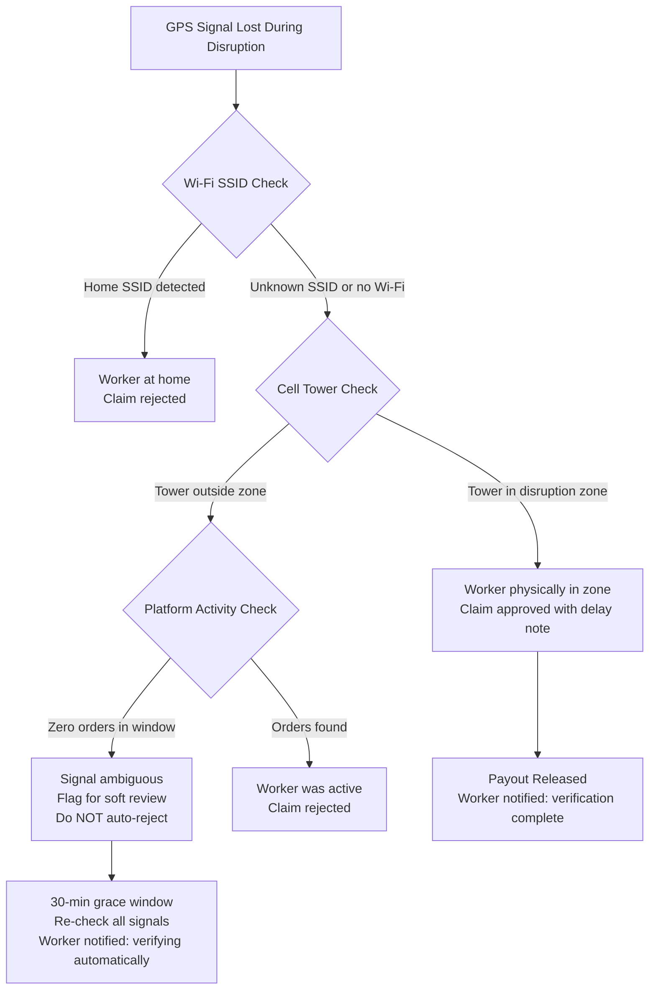
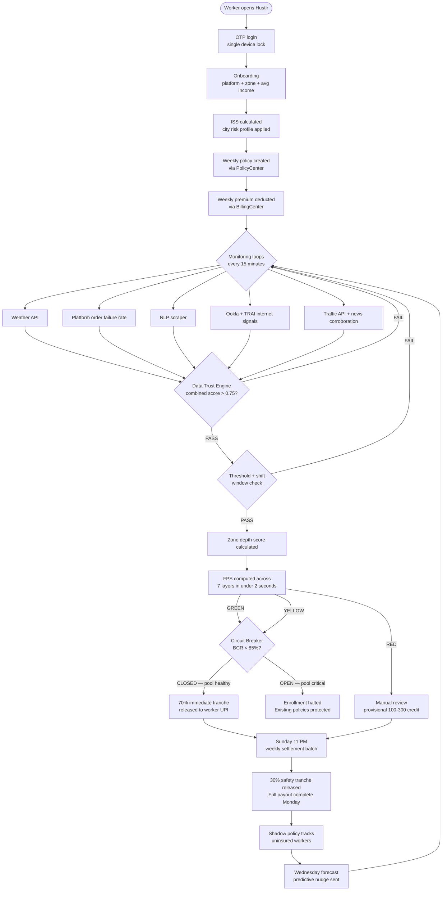
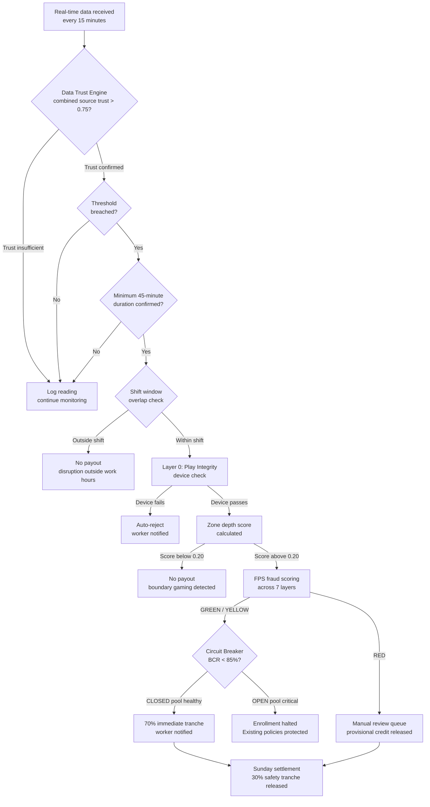
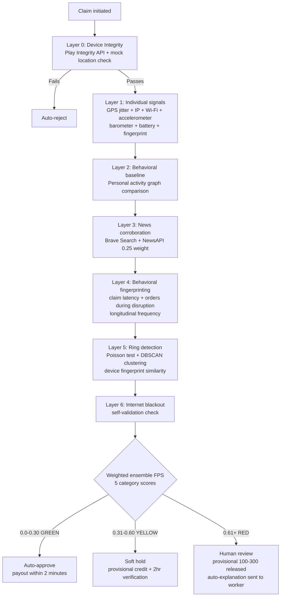

<div align="center">
  <h1>⚡ Hustlr</h1>
  <h3>Real-Time Income Protection Engine for India's Gig Delivery Workers</h3>

  <a href="https://youtu.be/nD2snI4Tnu8?si=eS5sztT0aibvxodI">
    
  </a>
  &nbsp;
  <a href="https://youtu.be/uEdGR915H-w">
    
  </a>
  &nbsp;
  <a href="https://youtu.be/GfnJ3xlfZVg">
    
  </a>
  <a href="https://youtu.be/9XGYfkqUMms">
    
  </a>
  &nbsp;
  <a href="https://1drv.ms/p/c/9ba6d7abf41d7da5/IQCtx_DQbutVQ4HHFKF4XSOJAcUCa4MkZ7YqDumyMsBPuBA?e=0zhCQV">
    
  </a>
  &nbsp;
  <a href="https://github.com/Dhruvv-16/Hustlr">
    
  </a>
  <br><br>
  <strong>🏆 Guidewire DEVTrails 2026 — Phase 3 (Soar) Submission</strong><br>
  <strong>👥 Team:</strong> Code Crafters &nbsp;|&nbsp; <strong>🎯 Persona:</strong> Q-Commerce Delivery Partners (Zepto)
</div>

---

## Pitch Deck

- Public deck link: https://1drv.ms/p/c/9ba6d7abf41d7da5/IQCtx_DQbutVQ4HHFKF4XSOJAcUCa4MkZ7YqDumyMsBPuBA?e=0zhCQV

## Recorded Video

- Phase 1 Demo: https://youtu.be/nD2snI4Tnu8?si=eS5sztT0aibvxodI
- Phase 2 Demo: https://youtu.be/uEdGR915H-w
- Phase 3 Part 1 Demo: https://youtu.be/GfnJ3xlfZVg
- Phase 3 Part 2 Demo: https://youtu.be/9XGYfkqUMms

## Source Code

- GitHub repository: https://github.com/Dhruvv-16/Hustlr

### Run Locally

```bash
git clone https://github.com/Dhruvv-16/Hustlr
cd Hustlr
flutter pub get
flutter run
```

### Dependencies

- Flutter SDK (stable)
- Dart SDK (included with Flutter)
- Android Studio / Android SDK (for Android builds)
- A connected Android device or emulator

### Secrets And Env Setup

- Never commit real secrets (`.env`, service account JSON, private keys).
- Backend env template lives at `hustlr-backend/.env.example`.
- Create local env files from the template and fill your own values:

```bash
cp hustlr-backend/.env.example hustlr-backend/.env
```

- Keep platform credential files local-only (`google-services.json`, `GoogleService-Info.plist`) unless you intentionally use demo placeholders.

## 🎬 Judge's Quick-Start Demo Guide

> **This section is for hackathon judges.** Follow this exact flow to experience the full Hustlr demo in under 3 minutes.

### Step 1 — Install the App

```bash
# Option A: Install the pre-built APK (Android only — recommended for full demo)
# Download Hustlr-demo.apk from the Releases tab
# On your Android device: Settings → Security → Allow unknown sources → Install

# Option B: Build from source
git clone https://github.com/Dhruvv-16/Hustlr
cd Hustlr
flutter pub get
flutter run                    # connect Android device first
flutter run -d chrome          # Web browser (sensor features limited)
```

### Step 2 — Onboard as a Delivery Partner

1. Open the app → tap **"Get Started"** on the welcome screen
2. Enter any name (e.g. `Karthik Shetty`) — it will be auto-capitalised
3. Enter any 10-digit phone number
4. Select **Zone** — pick any available Chennai zone (e.g. `Anna Nagar`)
5. Select **Platform** → `Zepto`
6. On the plan selection screen → choose **Standard Shield — ₹49/week**
7. Dashboard loads with your active policy card showing `Standard Shield · ₹49/week`

> ℹ️ The wallet starts at **₹0** (no payouts received yet). The ₹49 premium deduction is visible in "Recent Activity" below the balance.

### Step 3 — Trigger a Live Disruption (Demo Mode)

> ⚡ **This is the core demo flow — shows the full parametric insurance pipeline end-to-end.**

1. On the **Dashboard**, tap your **profile avatar** (top-right, green-bordered circle)
2. On the Profile screen, scroll down to find **"Demo Controls"** → tap it
3. A bottom sheet appears with 3 trigger buttons:

| Button                          | What it simulates                       | Payout amount |
| ------------------------------- | --------------------------------------- | ------------- |
| 🌧️ **Trigger Rain Disruption**   | IMD confirms 67mm rainfall in your zone | ₹120          |
| 📵 **Trigger Platform Downtime** | Zepto order failure rate exceeds 60%    | ₹140          |
| 🌡️ **Trigger Extreme Heat**      | IMD confirms 43°C sustained in zone     | ₹130          |

4. Tap **"Trigger Rain Disruption"** — a snackbar confirms the detection
5. Navigate to **Claims** tab → see a new claim card marked `PENDING`
6. Watch it auto-update to `APPROVED` after ~3 seconds ✅
7. Navigate to **Wallet** tab → balance now shows the payout credited
8. Tap **"Withdraw to UPI"** → enter `demo@ybl` → tap **"Initiate Transfer →"**
9. See the 2-second processing animation, then the **Transfer Initiated!** success screen

> ✅ **The demo state persists.** Trigger multiple events, switch screens, even close and reopen the app — the claims and wallet balance will still be there. Use **Reset Demo** to start fresh.

### Step 4 — Explore the App Screens

| Screen                      | What you'll see                                                                                                     |
| --------------------------- | ------------------------------------------------------------------------------------------------------------------- |
| **Dashboard**               | Active plan card (Standard Shield · ₹49), zone disruption alerts, rain prediction nudge, profile with your name     |
| **Claims**                  | All triggered parametric claims with PENDING → APPROVED status, full audit trail showing IMD/CPCB data sources      |
| **Wallet**                  | Payout balance, Smart Savings metric, UPI withdrawal flow, recent activity + insurance transaction history          |
| **Policy**                  | Plan comparison (Basic → Full Shield), shadow policy feature, premium breakdown, compound trigger info              |
| **My Protection Analytics** | Disruption bar chart (Mon–Sun), payout history (Heavy Rain · Platform Downtime · Extreme Heat), active plan summary |
| **Support → Live Support**  | AI chat — responds to questions about claims, payouts, zones, premiums, UPI withdrawals                             |
| **Support → FAQs**          | Parametric insurance explained in worker-friendly language                                                          |

### Step 5 — Live Support Chat Demo

1. Go to **Support** tab → tap **"Chat with us →"**
2. The agent greets you automatically
3. Tap any quick chip at the bottom to send a preset message:

| Chip             | Question sent                                 | AI response covers                                     |
| ---------------- | --------------------------------------------- | ------------------------------------------------------ |
| 🧾 Check my claim | "What is the status of my claim?"             | Auto-processing, no filing needed, 2hr payout timeline |
| 💧 Rain payout    | "How does the rain payout work?"              | IMD 64.5mm threshold, 70/30 tranche split              |
| 📍 My zone        | "Tell me about my zone coverage."             | Zone-specific IMD/CPCB sensor validation               |
| ₹ My premium     | "Why is my premium ₹49?"                      | Actuarial zone-risk pricing                            |
| 💰 Withdraw       | "How do I withdraw my payout balance to UPI?" | Razorpay UPI, 2hr settlement                           |
| 🛡️ Upgrade plan   | "What does Full Shield cover?"                | Full Shield ₹79/wk — bandh, AQI, dark store closure    |

---

## 🚀 Phase 3 — Soar: What's New (Weeks 5–6)

> **Phase 2 Judge Feedback (4/5 ⭐):** *"Hustlr is an exceptionally well-built parametric insurance platform that demonstrates deep technical sophistication and insurance domain expertise... one of the most complete and technically advanced submissions in the competition."*

Phase 3 builds directly on that foundation — hardening the real-world deployment layer. The three features we shipped address the final mile problem of actually running this on Indian budget Android hardware in the field: biometric identity, GPS reliability, and location permission UX.

### Feature 1: Biometric Auth — Two-Tier Identity Verification ✅

**The problem it solves:** Standard `local_auth` fails silently on many Indian budget Android devices (Xiaomi, Realme) that have biometric sensors enrolled in "Smart Lock" mode but don't expose them to third-party apps. Without a fallback, workers got stuck at auth.

| Tier                  | Method                                                   | Trigger Condition                                |
| --------------------- | -------------------------------------------------------- | ------------------------------------------------ |
| **Tier 1**            | Native OS Fingerprint / Face ID (`local_auth`)           | Default for all auth                             |
| **Tier 2 (Fallback)** | Google Cloud Vision camera liveness + profile face match | Device has no biometric enrolled OR Tier 1 fails |

**Key files:**
- `lib/services/biometric_service.dart` — `authenticateWithFallback()` orchestrates both tiers
- `lib/features/auth/step_up_auth_screen.dart` — camera selfie capture for Tier 2
- `lib/services/api_service.dart` — Google Cloud Vision API call + result metadata

**Fallback flow:**
```
Tier 1 (local_auth) → Success? → Done ✅
         ↓ Fail
Tier 2 (Google Cloud Vision liveness check)
         ↓ Captures selfie → Cloud Vision face detection
         → Match against stored profile → BiometricResult(usedFallback: true)
```

---

### Feature 2: Resilient Background GPS — Protected Foreground Task ✅ (Partial)

**The problem it solves:** Xiaomi MIUI, OnePlus OxygenOS, and other OEM Android skins aggressively kill background services after ~3 minutes. This silently terminated shift tracking mid-shift — workers were marked offline without warning, losing coverage during active deliveries.

**What's implemented:**
- `ShiftTrackingService` now initialises Android OS Protected Foreground Task via `flutter_foreground_task`
- Position stream runs with `enableWakeLock: true` inside the foreground task lifecycle
- **Watchdog timer** fires every 60 seconds — detects dead position stream → attempts auto-restart → gracefully pauses coverage only if restart fails (no silent drop)

**What remains (TODO):**
- Xiaomi MIUI test device validation (requires physical device lab)
- `AndroidManifest.xml` foreground service permission entries
- Notification channel setup for persistent shift notification

**Key additions to `shift_tracking_service.dart`:**
```dart
// Watchdog auto-restart — never silently drops GPS
Timer.periodic(Duration(seconds: 60), (_) {
  if (_positionSubscription == null) _attemptWatchdogRestart();
});
```

---

### Feature 3: Location Degradation UX — Foreground-Only Mode ✅

**The problem it solves:** Previously, any location permission below "Always Allow" blocked the worker from going online entirely. On Android 13+, many users grant "While Using App" by default and never revisit. This locked out a significant portion of workers.

**New behavior:**
- Workers with "While Using App" permission can now go online ✅
- An **amber warning banner** appears on the dashboard: *"Location needed while app is open. Keep app open during shifts."*
- Shift protection remains fully active for the foreground session — claims process normally
- Workers who background the app during a shift see coverage automatically pause (with notification)

**Permission levels now tracked:**

| Mode            | `LocationPermissionMode` | Behaviour                                     |
| --------------- | ------------------------ | --------------------------------------------- |
| Always Allow    | `always`                 | Full background tracking                      |
| While Using App | `whenInUse`              | Foreground-only, amber banner shown           |
| Denied          | `denied`                 | Cannot go online, permission prompt triggered |

**Key files:**
- `lib/services/location_permission_service.dart` — `getLocationPermissionMode()` enum
- `lib/features/dashboard/` — amber warning banner + "Go Online" conditional logic

---

### Phase 3 Summary

| Priority  | Feature                                         | Status                                | Impact                                              |
| --------- | ----------------------------------------------- | ------------------------------------- | --------------------------------------------------- |
| ✅ DONE    | Biometric Tier 2 (Google Cloud Vision)          | Implemented                           | Handles all devices with no biometric availability  |
| ✅ DONE    | Location Degradation UX (Foreground Mode)       | Implemented                           | Unblocks workers on Android 13+ default permissions |
| 🔄 PARTIAL | Protected Foreground GPS (Watchdog + Wake Lock) | Code complete, device testing pending | Fixes GPS drops on Xiaomi/OnePlus OEM skins         |

### Phase 3 Dependencies Added

```yaml
# pubspec.yaml
flutter_foreground_task: ^4.0.0
google_mlkit_face_detection: ^0.10.0
google_cloud_vision: ^5.0.0
camera: ^0.10.0
image: ^4.0.0
```

---

## ✅ Phase 2 Highlights — What's Live

| Area                      | What's Implemented                                                                                                       |
| ------------------------- | ------------------------------------------------------------------------------------------------------------------------ |
| **Parametric Engine**     | 5 automated triggers live (Rain, Heat, AQI, Platform Downtime, Bandh  ) — real IMD/CPCB/NewsAPI data in production       |
| **Mobile App**            | Flutter app with full onboarding, dashboard, claims, wallet/UPI withdrawal, policy management, live support chat         |
| **Backend**               | Node.js + Supabase — policy creation, premium billing, payout dispatch, circuit breaker, fraud scoring                   |
| **ML Models**             | ISS risk scoring, NLP disruption scraper, fraud detection (7-layer), zone depth scoring, connectivity anomaly detection  |
| **Demo Mode**             | Offline parametric trigger simulation — Rain/Heat/Platform Downtime with persistent claim + wallet state across restarts |
| **Live Support**          | AI chat agent responding to 11 insurance topics with Hustlr-specific parametric answers                                  |
| **Guidewire Integration** | PolicyCenter + ClaimCenter + BillingCenter API integration scaffolded and documented                                     |

---


## 📋 Table of Contents

1. [TL;DR](#-tldr)
2. [The Problem](#-the-problem)
3. [What Hustlr Is](#-what-hustlr-is)
4. [Chosen Persona: Q-Commerce Delivery Partner](#-chosen-persona-q-commerce-delivery-partner)
5. [How Hustlr Works — 15-Second View](#-how-hustlr-works--15-second-view)
6. [What Hustlr Covers](#-what-hustlr-covers)
7. [Insurance Partner Model](#-insurance-partner-model)
8. [Guidewire Integration](#️-guidewire-integration)
9. [Parametric Logic — Core Principle](#-parametric-logic--core-principle)
10. [Trigger Parameters](#-trigger-parameters)
11. [Compound Triggers — Full Shield](#-compound-triggers--full-shield)
12. [Anti-Gaming Rules](#-anti-gaming-rules)
13. [Manual Claim Filing — UX Flow](#-manual-claim-filing--ux-flow)
14. [Internet Zone Blackout — Trigger Architecture](#-internet-zone-blackout--trigger-architecture)
15. [Accident Blockspot — Trigger Architecture](#-accident-blockspot--trigger-architecture)
16. [Heavy Traffic Congestion — Trigger Architecture](#-heavy-traffic-congestion--trigger-architecture)
17. [Real Scenario Simulations](#-real-scenario-simulations)
18. [Adversarial Defense & Anti-Spoofing Strategy](#️-adversarial-defense--anti-spoofing-strategy)
19. [Zone Depth Scoring — Anti-Boundary Gaming](#-zone-depth-scoring--anti-boundary-gaming)
20. [AI/ML Architecture](#-aiml-architecture)
21. [Regional Behavioral Intelligence Layer](#-regional-behavioral-intelligence-layer)
22. [Innovation Differentiators](#-innovation-differentiators)
23. [Weekly Premium Tiers](#-weekly-premium-tiers)
24. [City Risk Profiles](#️-city-risk-profiles)
25. [End-to-End Workflow](#-end-to-end-workflow-full)
26. [Parametric Trigger Decision Flow](#-parametric-trigger-decision-flow)
27. [Fraud Detection Decision Flow](#-fraud-detection-decision-flow)
28. [System Reliability — Fallback Hierarchy](#-system-reliability--fallback-hierarchy)
29. [Platform Decision — Mobile App (Flutter)](#️-platform-decision--mobile-app-flutter)
30. [Tech Stack](#️-tech-stack)
31. [Phase 2: Backend Micro-Services Architecture](#-phase-2-backend-micro-services-architecture)
32. [Phase 2: Database Architecture — Supabase Triggers](#-phase-2-database-architecture--supabase-triggers)
33. [Phase 2: Registration & Onboarding Flow](#-phase-2-registration--onboarding-flow)
34. [Phase 2: Insurance Policy Management](#-phase-2-insurance-policy-management)
35. [Phase 2: Dynamic Premium Calculation](#-phase-2-dynamic-premium-calculation)
36. [Phase 2: Claims Management](#-phase-2-claims-management)
37. [Phase 2: Payout Dispatch](#-phase-2-payout-dispatch)
38. [Phase 2: Economic Circuit Breaker](#-phase-2-economic-circuit-breaker)
39. [MVP Scope — Phase 1 ✅ & Phase 2 ✅](#-mvp-scope--phase-1--phase-2-)
40. [Cost Efficiency](#-cost-efficiency)
41. [6-Week Plan](#-6-week-plan)
42. [Business Viability & Financial Model](#-business-viability--financial-model)
43. [IRDAI Compliance](#-irdai-compliance)
44. [Team](#-team)
45. [Phase 2 Deliverables](#-phase-2-deliverables)
46. [Phase 3 Soar Deliverables](#-phase-3-soar-deliverables)

---

## 🧭 TL;DR

**Who:** Q-commerce delivery riders (Zepto) — 2–3 km radius, one dark store, zero income safety net.

**Problem:** One flooded street eliminates their entire working zone. No insurance product covers this. 80+ disruption days a year go uncompensated.

**What Hustlr does:** Monitors 9 real-time disruption triggers. When one fires and the rider is on shift — a fixed payout hits their UPI automatically. No claim filed. No adjuster. Under 2 minutes.

**How it's built:** Flutter app · Node.js + Supabase backend · 7 AI/ML models · 7-layer fraud engine · Zone depth scoring · Regional behavioral intelligence · Full Guidewire integration (PolicyCenter + ClaimCenter + BillingCenter) · BLoC state management · Modular micro-services backend.

**Numbers:** ₹35–₹79/week · Tier-locked caps · 6–7× consistent multiplier across all plans · ₹0 infrastructure cost · 10,000-worker Chennai pilot · 5 live automated triggers · 70/30 tranche payout · 4-tier Data Trust Engine · BCR Circuit Breaker · Hard MPL ceiling — zero exceptions.

> *"When there's a curfew, I can't deliver. When the app crashes, I can't deliver. When a road accident blocks my route, I can't deliver. Those days, I earn zero rupees — but my rent doesn't know that."*
> — **Karthik, 24, Zepto Q-commerce delivery rider, Chennai**

---

## 🔴 The Problem

India has **7.7 million** gig delivery workers. Q-commerce riders — the people delivering groceries in 10 minutes for Zepto — face the sharpest version of this problem. They operate within a strict 2–3 km radius of a single dark store. They earn ₹4,000–₹6,000 per week with no paid leave, no sick days, and no safety net. One flooded street eliminates their entire working zone. A dark store going offline wipes out a full shift. Chennai alone sees **~80 rain days per year** — on each one, a rider loses ₹400–₹600. Cyclone Michaung wiped out 3–4 days of income per worker with zero recourse.

Every existing insurance product covers accidents, hospitalization, and death — events that happen rarely. Not one covers the income disruption that happens 80+ days a year.

Hustlr fixes the right problem.

---

## 💡 What Hustlr Is

Hustlr is **not an insurance company.** It is an **underwriting intelligence engine** that enables licensed insurers to profitably serve gig workers — a segment traditional insurance has never been able to reach.

---

## 👤 Chosen Persona: Q-Commerce Delivery Partner

**Persona:** A Zepto delivery partner operating in Chennai — Velachery, Adyar, or Tambaram dark store zones.

Workers are registered on a **single primary platform only**, in compliance with Zepto's partner exclusivity agreement. Insurance is priced based on that platform's activity data alone — keeping the model legally clean and operationally simple.

### Why Q-Commerce?

| Factor                  | Q-Commerce (Zepto)           | Food (Zomato/Swiggy) | E-Commerce (Amazon/Flipkart) |
| ----------------------- | ---------------------------- | -------------------- | ---------------------------- |
| Delivery frequency      | 15–25 orders/day             | 8–15 orders/day      | 3–8 orders/day               |
| Hyperlocal sensitivity  | Extreme (dark store zones)   | High                 | Moderate                     |
| Weather vulnerability   | Critical (monsoon paralysis) | High                 | Low–Medium                   |
| Worker density per zone | Very high (cluster-based)    | Medium               | Spread out                   |
| Fraud surface area      | High (zone-based clustering) | Medium               | Low                          |

Q-commerce workers operate within **tight geographic zones** anchored to dark stores, making parametric triggers more precise (zone-level, not city-level), fraud detection more nuanced (cluster behaviour becomes a signal), and income modeling more predictable (orders/hour baselines are tight).

### Persona Profile: "Karthik, 24, Zepto Partner, Adyar Dark Store Zone, Chennai"

| Attribute                  | Value                                                        |
| -------------------------- | ------------------------------------------------------------ |
| Platform                   | Zepto (single platform — partner agreement compliant)        |
| Weekly earnings            | ₹4,200 (~₹600/day, ~₹60/hr over a 10-hr shift)               |
| Shift window               | 8 AM – 10 PM (derived from 30-day activity history)          |
| Peak slots                 | Morning 8–11 AM · Evening 5–9 PM                             |
| Delivery radius            | 2–3 km from Adyar dark store — zone loss = total income loss |
| Device                     | Android budget phone (~₹10,000)                              |
| Payments                   | UPI for all transactions                                     |
| Savings buffer             | 2–3 days of income at most                                   |
| Financial obligations      | Weekly rent + monthly family remittances                     |
| Annual disruption exposure | ~80 rain days · loses ₹400–₹600 per heavy rain day           |

**Key disruptions Karthik faces:**

| Disruption             | Frequency                        | Impact                                                |
| ---------------------- | -------------------------------- | ----------------------------------------------------- |
| Heavy monsoon rain     | ~80 days/year                    | Zone completely unserviceable for 3–6 hours           |
| Cyclone / extreme rain | 2–4 events/year                  | 3–4 days of income wiped out (Cyclone Michaung scale) |
| Platform app outage    | ~2–3 times/month                 | Zero orders possible regardless of conditions         |
| Bandh / curfew         | ~8–10 days/year                  | Roads blocked, platform auto-pauses                   |
| Internet zone blackout | ~6–10 days/year                  | Entire operating environment goes dark                |
| Accident blockspot     | Weekly on GST Road / IT Corridor | 1–3 hour income gap per incident                      |

---

## ⚡ How Hustlr Works — 15-Second View

<p align="center">
  
</p>

```
1. Rain detected in Karthik's zone    →  IMD + OpenWeatherMap confirm threshold
2. Data Trust Engine validates         →  Combined source trust 0.85 — exceeds 0.75 threshold
3. Shift window check passes           →  disruption falls within Karthik's working hours
4. Zone depth score calculated         →  confirms Karthik was genuinely deep in zone, not at boundary
5. Device integrity verified           →  Play Integrity API confirms no GPS spoofing app active
6. Fraud check in < 2 seconds          →  FRS score computed across 7 independent signal layers
7. Circuit Breaker confirms pool OK    →  BCR at 44% — well below 85% ceiling
8. 70% tranche credited same day       →  ₹105 to UPI instantly for urgent expenses
9. 30% safety tranche Sunday night     →  ₹45 after full-week fraud pattern review
```

No forms. No adjusters. No claim ever filed by the worker — for automated trigger events.

---

## ✅ What Hustlr Covers

| Covered                                                                 | Not Covered                               |
| ----------------------------------------------------------------------- | ----------------------------------------- |
| Lost income during weather shutdowns (rain, cyclone, extreme heat, AQI) | Vehicle repairs or damage                 |
| Lost income during platform-declared outages                            | Medical or accident expenses              |
| Lost income during civil disruptions (curfew, bandh, strike)            | Personal illness or fatigue               |
| Lost income during internet zone blackouts                              | Low-order days due to competition         |
| Lost income due to accident blockspots on hotspot corridors             | Income loss outside declared shift window |
| Lost income during severe traffic congestion (Full Shield)              | Events with no corroborating data source  |

---

## 🏢 Insurance Partner Model

| Role                              | Entity                                                        |
| --------------------------------- | ------------------------------------------------------------- |
| **Risk Underwriter**              | Licensed insurer — ICICI Lombard / HDFC ERGO                  |
| **Trigger + Intelligence Engine** | Hustlr                                                        |
| **Policy Administration**         | Guidewire PolicyCenter API                                    |
| **Claims Automation**             | Guidewire ClaimCenter API                                     |
| **Premium Billing**               | Guidewire BillingCenter API                                   |
| **Distribution — Phase 1**        | Direct B2C — Hustlr mobile app via WhatsApp groups + referral |
| **Distribution — Phase 2**        | B2B2C — Zepto platform integration + insurer white-label      |

---

## ⚙️ Guidewire Integration

### PolicyCenter
- Weekly policy creation every Monday via PolicyCenter API
- ISS score + city risk profile passed as risk attributes for premium computation
- Policy status synced back to Hustlr in real time

### ClaimCenter
- On parametric trigger: Hustlr pushes a structured, pre-validated claim payload
- Fraud Risk Score attached — ClaimCenter routes CLEAN to auto-approval, FLAGGED to human queue
- On manual claim: worker-submitted proof package routed directly to ClaimCenter review queue
- Zero-touch for weather/bandh/internet events. Structured review for manual claim types.

### BillingCenter
- Weekly premium deduction via BillingCenter direct debit scheduling
- Payout disbursement coordinated through BillingCenter's payment gateway
- Worker wallet reconciliation synced weekly

### Guidewire Marketplace
- Hustlr packaged as a Marketplace integration — any insurer on PolicyCenter/ClaimCenter can onboard Hustlr's parametric trigger engine as a configurable product extension

### B2B2C Distribution Channel (Phase 2)
After proving the model B2C, Hustlr embeds directly inside the Zepto partner app as a white-label insurance feature. Zepto pays a per-worker monthly licensing fee. The insurer underwrites the risk. Guidewire collects a technology licensing fee from the insurer.

**Why platforms pay for this:**
- Reduces worker churn during bad weather
- Differentiates Zepto in recruiting delivery partners from competitors
- Fulfills ESG mandate: "we protect our delivery partners"

---

## 📊 Parametric Logic — Core Principle

Hustlr does **not** calculate actual income loss. No investigation needed for automated triggers.

- A measurable disruption index is monitored in real time
- When it crosses a threshold AND falls within the worker's shift window → payout fires
- Payout = fixed rate per trigger type × verified disruption hours (capped at ₹150/day, ₹500/week)

```
Example:
  Trigger:          Heavy rain — IMD confirms 72mm, threshold 64.5mm crossed
  Duration:         3 hours above threshold
  Plan:             Standard Shield
  Fixed rate:       ₹40/hr (Heavy Rain, Standard Shield)

  Payout = ₹40 × 3 = ₹120  →  within Standard Shield ₹150 daily cap  →  APPROVED
  70% (₹84) credited within 2 hours. 30% (₹36) settled Sunday night.
```

**Why weekly settlement for the 30% tranche:** The fraud engine evaluates the complete week's pattern before the final tranche releases. A worker who triggers 3 events in one week activates the claim velocity signal before the safety tranche moves. Weekly settlement also matches Zepto's weekly partner payment cycle.

**Why 60–70% income replacement, not 100%:** Parametric insurance by design does not fully replace income — this is basis risk, and it is intentional. Paying ₹50/hr (67% replacement) means honest workers are protected without the product becoming a profit opportunity. Full replacement creates moral hazard. The 60–70% band is the industry standard for parametric income protection.

---

## 🚨 Trigger Parameters

### Automated Parametric Triggers

| Trigger                     | Threshold                               | Data Source             | Hourly Rate | Daily Cap | Min Plan             | Freq/yr |
| --------------------------- | --------------------------------------- | ----------------------- | ----------- | --------- | -------------------- | ------- |
| Heavy Rain                  | 64.5–115mm/hr                           | IMD + OpenWeatherMap    | ₹40/hr      | ₹120      | All plans            | 8×      |
| Extreme Rain / Cyclone band | ≥ 115.6mm/hr                            | IMD + OpenWeatherMap    | ₹65/hr      | ₹200      | **Full Shield only** | 2×      |
| Heat Wave                   | ≥ 43°C · IMD forecast                   | IMD                     | ₹45/hr      | ₹130      | All plans            | 5×      |
| Severe Pollution            | AQI ≥ 200                               | AQICN / WAQI            | ₹35/hr      | ₹100      | Standard Shield      | 3×      |
| Platform App Outage         | Order failure rate > 60%                | Platform API            | ₹50/hr      | ₹140      | Standard Shield      | 6×      |
| Bandh / Strike / Curfew     | NLP confidence ≥ 0.6 + platform OFFLINE | NewsAPI + NLP           | ₹55/hr      | ₹150      | Standard add-on only | 3×      |
| Heavy Traffic Congestion    | Speed ≥ 40% below baseline, ≥ 45 min    | Google Maps Traffic API | ₹30/hr      | ₹80       | Full Shield          | 10×     |
| Internet Zone Blackout      | Connectivity < 10% for ≥ 30 min         | Ookla / TRAI            | ₹45/hr      | ₹110      | Standard add-on only | 2×      |
| Cyclone Landfall            | IMD Category 1–5 · Oct–Dec              | IMD                     | ₹80/hr      | ₹250      | **Full Shield only** | 0.4×    |

> **The Min Plan column is canonical.** A Basic Shield worker experiencing a cyclone trigger receives only their plan's daily cap (₹100/day) — not the cyclone rate. **The product you are buying at each tier is the cap, not the trigger list.** Cyclone's ₹250/day rate and ₹80/hr rate are accessible only on Full Shield.

### Payout Caps Are Tier-Locked, Not Trigger-Locked

| Plan            | Daily Cap | Weekly Cap | Cap Multiplier |
| --------------- | --------- | ---------- | -------------- |
| Basic Shield    | ₹100/day  | ₹210/week  | 6.0× premium   |
| Standard Shield | ₹150/day  | ₹340/week  | 6.9× premium   |
| Full Shield     | ₹250/day  | ₹500/week  | 6.3× premium   |

**Why consistent multipliers matter:** All three plans maintain a 6–7× premium-to-cap ratio. This ensures equal exposure per rupee of premium across tiers — the actuarial foundation of a sustainable pool. Previous structures (₹900 Full Shield cap = 11.4× multiplier) were fundamentally broken because the highest-paying plan also carried the highest risk per rupee. The corrected structure normalises this.

**Shift-time payout modifier (applied to all hourly rates):**

| Shift window            | Rate modifier       |
| ----------------------- | ------------------- |
| Peak (9 AM – 6 PM)      | 100% of hourly rate |
| Off-peak (6 PM – 10 PM) | 75% of hourly rate  |
| Pre-peak (8 AM – 9 AM)  | 50% of hourly rate  |

**Plan tier multiplier on caps:**
- Basic Shield: 1.0× base cap
- Standard Shield: 1.25× base cap
- Full Shield: 1.5× base cap · compound triggers unlock additional 1.2–1.3×

### Manual Claim Triggers

| Trigger                    | What Worker Submits                                                        | Cross-Check Sources                                | SLA   |
| -------------------------- | -------------------------------------------------------------------------- | -------------------------------------------------- | ----- |
| Traffic Accident Blockspot | GPS screenshot + scene photo (EXIF-stamped) + platform earnings screenshot | Google Maps Traffic API + News API + order density | 4 hrs |
| Local Road Closure         | Same as above                                                              | Municipal advisory feed + Maps                     | 4 hrs |
| Dark Store / Hub Shutdown  | Photo of closed hub + Zepto screenshot                                     | Platform API + NLP scraper                         | 4 hrs |

---

## ⚡ Compound Triggers — Full Shield

Full Shield workers receive compound trigger payouts when two disruptions occur simultaneously.
Compound payouts use multipliers — not simple addition — because simultaneous disruptions 
cause multiplicative income loss, not additive.

| Compound Combination    | Multiplier                | Rule                                |
| ----------------------- | ------------------------- | ----------------------------------- |
| Rain + Platform Outage  | 100% of both rates        | Both triggers active simultaneously |
| Heatwave + AQI          | 110% on higher rate       | Co-occurring environmental peril    |
| Cyclone + Bandh         | 120% on cyclone rate      | Civil + weather compound            |
| Extreme Rain + Blackout | 130% on extreme rain rate | Catastrophic scenario               |

### The Hard Ceiling Principle — Cap Acceleration, Not Cap Lifting

**The ₹500 weekly cap on Full Shield is an absolute hard ceiling. There are zero exceptions.**

Compound multipliers increase the **velocity** of the payout, not the limit. During severe compound events, the increased hourly rate allows the worker to max out their ₹500 cap faster — in fewer hours of disruption — providing immediate peak financial relief without breaking the pool's Maximum Probable Loss (MPL) constraints.

```
Example — Extreme Rain + Blackout (130% multiplier):

  Base Rate (Extreme Rain):      ₹65/hr
  Compound Rate (130%):          ₹84.5/hr

  Old model (cap lift — REMOVED):
    Worker gets ₹84.5/hr until ₹650. Actuary cannot bound MPL. ❌

  New model (cap acceleration):
    Worker gets ₹84.5/hr until ₹500. Cap reached in ~6 hours
    instead of ~8 hours. MPL is mathematically locked. ✅
```

**Why this is better for workers:** "When the worst disasters hit, Hustlr pays you faster. You get your full ₹500 weekly safety net in just a few hours." The value proposition is speed of relief, not a higher ceiling.

**Why this is better for the insurer:** The absolute maximum exposure per Full Shield worker is strictly ₹500. No catastrophic event can push it higher. Reinsurers can price this as a hard MPL with zero ambiguity.

**Compound trigger access:** Only Full Shield plan. Basic and Standard Shield pay for the 
worst single trigger only — not compound bonuses.

**Claim-Free Cashback (Full Shield):**
Workers on Full Shield who complete 4 consecutive weeks without a payout receive 10% of 
their premiums returned as wallet credit. BCR must remain healthy (below 0.70) for cashback 
to disburse. This solves adverse selection — rewarding workers who stay insured during 
calm periods builds a healthier premium pool. Cost to insurer: ~₹43 per qualifying period.

---

## 🛡️ Anti-Gaming Rules

- **Minimum duration:** 45 continuous minutes above threshold before trigger activates
- **Cooling period:** Same disruption type cannot trigger again in same zone within 24 hours
- **Shift intersection:** Disruption must overlap worker's registered shift by minimum 2 hours
- **One event per week per type** for Basic and Standard Shield plans
- **Pro-rata for mid-week activation:** Worker activating on Thursday receives payout weighted by days active
- **Post-purchase coverage only:** Disruptions beginning before policy activation are never covered
- **Quarterly commitment:** Plans and add-ons are quarterly (13-week) commitments, not weekly toggles

### Threshold Obfuscation + Dynamic Micro-Variation

**Exact trigger thresholds are never published.** Workers see only ranges — never specific millimetre values.

The actual trigger threshold varies by ±3mm (rain) or ±0.5°C (heat) each week using a seeded random value known only to the system. Workers can never predict the exact number for the current week.

**Why this matters for Chennai specifically:** Research into Chennai delivery worker behavior reveals workers are highly financially sophisticated and actively probe incentive systems. The Rapido/cab driver pattern of gaming platform incentives is directly applicable to insurance threshold gaming. Workers in organized groups can identify precise thresholds through repeated testing and share them via WhatsApp. Threshold micro-variation makes this strategy unreliable.

---

## 📊 AI Pricing Factors — Backend Only, Never Shown to Worker

These factors feed the ISS score and fraud engine. None are disclosed to workers.

### Personal Activity Graph (PAG)
2-week behavioral baseline tracking order cadence, GPS movement patterns, and typical 
shift duration. A claim during a shift where PAG shows significantly below-normal activity 
raises FPS score by +0.18 weight. Workers cannot game this because they do not know 
what "normal" looks like in the system's model of them.

### News Corroboration Coefficient
Brave Search + NewsAPI scan for corroborating reports of the trigger event. If no credible 
news source mentions the event within 2 hours of trigger fire → +0.25 FPS weight. If 3+ 
sources confirm → -0.15 FPS discount (genuine disaster event, reduce scrutiny).

### Ring Network Detection (DBSCAN)
Isolation Forest + DBSCAN identifies claim clusters. If 5+ workers from the same zone 
claim within 20 minutes of each other with suspiciously similar GPS coordinates, ring fraud 
flag auto-triggers full human review.

### Threshold Micro-Variation (Anti-Gaming)
Rain threshold published as "≥64.5mm/hr" but actual trigger varies ±3mm each week seeded 
from worker ID. A worker who times shelter behavior exactly to the published threshold will 
sometimes fail — they can never know the true threshold for their account that week.

---

## 📱 Manual Claim Filing — UX Flow

Workers filing a manual claim tap **"Report a Disruption"** on the Claims screen. This opens a 3-step guided flow designed for one-thumb operation on a budget Android device.

**Step 1 — Select Disruption Type**
```
Worker sees:
  🚧  Road Blocked / Accident
  🏪  Dark Store / Hub Closed
  🌐  Internet Outage (zone-level)
  📦  Other Delivery Blockage
```

**Step 2 — Capture Evidence (in-app, EXIF-stamped)**
```
Disruption Type          What the app asks for
─────────────────────────────────────────────────────────────────
Road Blocked / Accident  1 photo (app GPS-stamps at capture)
Dark Store / Hub Closed  1 photo + Zepto screenshot (no orders)
Internet Outage          App auto-reads signal strength — no photo
Other                    1 photo + description (max 100 chars)
```

**Step 3 — Submission & Tracking**
```
Worker sees:
  "Claim submitted. We're checking 3 data sources."

Within 4 hours:
  → AUTO-APPROVED: "₹X credited to your wallet"
  → NEED MORE INFO: "Tap here to add one more photo"
  → DECLINED + EXPLANATION: "Here's why, and how to appeal"
```

---

## 🌐 Internet Zone Blackout — Trigger Architecture

India's gig workers are uniquely vulnerable to localized internet outages. A Zepto Q-commerce rider cannot accept orders, navigate, or scan QR codes during a connectivity blackout. One pincode blackout eliminates their entire working zone instantly.

```
Signal 1 — Ookla Real-Time Speed Map API
  Zone average download speed < 2 Mbps for 20 minutes  →  degraded flag

Signal 2 — Device crowd-reporting (passive)
  ≥ 30% of active Hustlr users in a pin-code report < 1 bar signal
  →  cluster anomaly flag

Signal 3 — TRAI outage registry
  Any registered outage for zone's ISP/tower operator  →  authoritative flag

Dual-confirmation rule:
  Signal 1 + Signal 2  →  AUTO_TRIGGER
  Signal 3 alone        →  AUTO_TRIGGER
  Signal 1 alone        →  HOLD for 20-minute reconfirmation window
```

**Fraud resistance:** Faking connectivity loss requires active data transmission to submit the claim — which is self-contradictory. This makes the internet blackout trigger one of Hustlr's most inherently fraud-resistant signals.

---

## 🚧 Accident Blockspot — Trigger Architecture

Chennai's road network has documented high-frequency accident corridors — Rajiv Gandhi Salai, GST Road, and Poonamallee High Road account for a disproportionate share of delivery-hour blockages.

```
Google Maps Traffic API:
  Route speed < 5 km/h on major corridor for ≥ 30 minutes  →  gridlock flag

Cross-checked against:
  NewsAPI / NLP scraper: "accident", "collision", "road blocked"
  in that zone within past 45 minutes  →  corroborated

Worker-assisted confirmation:
  Push: "Accident blocking detected on GST Road near you. Affected?"
  Worker: tap confirm + upload 1 photo

Hustlr cross-checks:
  →  Worker GPS on that corridor in last 30 min?
  →  Zero completed orders in that window?
  →  Is blockspot on Chennai Accident Hotspot Map?
```

**Chennai Accident Hotspot Map:**

| Tier   | Corridors                                           | Skepticism Weight |
| ------ | --------------------------------------------------- | ----------------- |
| Tier 1 | GST Road, Rajiv Gandhi Salai, Poonamallee High Road | Low               |
| Tier 2 | Anna Salai, Velachery Main Road, OMR                | Medium            |
| Tier 3 | Internal streets, zone-internal routes              | High              |

---

## 🚦 Heavy Traffic Congestion — Trigger Architecture

```
Step 1 — Build historical baseline per corridor per 30-min time slot:
  Google Maps Traffic API → rolling 90-day average speed

Step 2 — Detect abnormal deviation:
  Current speed < (baseline − 40%) sustained ≥ 45 minutes  →  severe flag

Step 3 — Platform order failure corroboration:
  Order failure rate in affected zone > 35%  →  confirmed

All three conditions must be met simultaneously → AUTO_TRIGGER
```

**City-specific corridor baselines ✅ (Phase 2 live — all 4 cities):**

| City      | High-Risk Corridor           | Baseline   | Trigger Threshold |
| --------- | ---------------------------- | ---------- | ----------------- |
| Chennai   | GST Road, Anna Salai         | 18–22 km/h | < 11–13 km/h      |
| Bengaluru | Electronic City Flyover, ORR | 15–20 km/h | < 9–12 km/h       |
| Mumbai    | Eastern Express Highway, WEH | 20–25 km/h | < 12–15 km/h      |
| Delhi     | NH48, Gurugram corridor      | 22–28 km/h | < 13–17 km/h      |

---

## 📋 Real Scenario Simulations

### Scenario A — Chennai November Rain (Fully Automated — Phase 2)

```
Circuit BCR:  Pool at 44% — well within 85% ceiling  →  CIRCUIT CLOSED

Payout = ₹50/hr × 3 hrs = ₹150

Timeline:
  11:00 AM  →  IMD threshold crossed
  11:02 AM  →  Data Trust Engine: combined 0.85 — PASS
  11:02 AM  →  Zone depth: 0.84 — PASS
  11:02 AM  →  Fraud engine: FRS = 14 — CLEAN
  11:02 AM  →  Circuit Breaker: BCR 44% — CLOSED
  11:02 AM  →  Claim logged PENDING — Karthik notified: "Rain disruption detected"
  Sunday    →  70% tranche (₹105) released to Karthik's UPI
  Tuesday   →  30% safety tranche (₹45) released after review window
```

### Scenario B — Shadow Policy Activation

```
Karthik has no active policy this week.
Rain disruption hits Adyar zone Thursday.
System silently calculates: if Karthik had Standard Shield,
he would have received ₹150 in payout.

Accumulated over 2 weeks: ₹680 in missed payouts.

Wednesday notification:
  "You missed ₹680 in payouts this fortnight.
   Activate Standard Shield now — ₹49/week."

One tap — policy activated. Coverage starts Monday.
```

### Scenario C — Predictive Activation (Wednesday Nudge)

```
Wednesday evening — Hustlr's 72-hour forecast runs.
OpenWeather shows: 78% probability of IMD Very Heavy Rain
in Adyar zone on Friday 2 PM–6 PM.

Karthik receives push notification:
  "Heavy rain expected Friday in your zone.
   Activate ₹49 Standard Shield now to protect ₹600+ earnings."

Karthik taps → policy activated → Friday rain hits →
claim auto-triggered → ₹150 Sunday night.
The system predicted, nudged, protected, and paid —
all before the worker even thought about insurance.
```

### Scenario D — Platform App Outage (Automated via Order Failure Rate)

```
Zepto status page: "operational"
Hustlr detects: order_failure_rate = 78%  →  threshold 60% crossed

Order failure rate overrides status API — reflects ground reality.
Workers on Standard Shield receive auto-claim for outage duration.
```

### Scenario E — Cyclone (Full Shield — Cap Acceleration)

```
Cyclone + Blackout compound trigger fires.
130% multiplier on Extreme Rain rate: ₹65/hr × 1.30 = ₹84.5/hr

Without compound (base rate):  Worker reaches ₹500 cap in ~7.7 hours
With compound (130% rate):     Worker reaches ₹500 cap in ~5.9 hours

MPL per Full Shield worker: ₹500. Unchanged. Zero exceptions.
Worker receives full ₹500 faster — "Instant Relief" during worst events.
```

---

## 🛡️ Adversarial Defense & Anti-Spoofing Strategy

### The Threat

A coordinated syndicate of 500 workers organizes via Telegram. Using GPS spoofing apps, they fake their location inside a rain-alert zone while sitting at home, triggering mass false payouts.

### Why GPS Spoofing Fails Against Hustlr

Hustlr never trusts a single signal. Every payout requires **multi-stream coherence** across independent data channels that a spoofing app cannot simultaneously fake.

| Signal Layer                          | What It Measures                 | What Spoofing Looks Like                                    |
| ------------------------------------- | -------------------------------- | ----------------------------------------------------------- |
| GPS coordinates                       | Claimed location                 | Too perfect — zero statistical jitter over 5-minute windows |
| Cell tower triangulation (OpenCelliD) | Tower the device is connected to | Home tower ID doesn't match flood zone                      |
| Wi-Fi fingerprint                     | SSIDs visible to device          | Known home SSID present = flagged                           |
| IP geolocation (MaxMind)              | ISP + approximate location       | Home broadband IP ≠ claimed outdoor zone                    |
| Accelerometer / motion                | Physical movement patterns       | Stationary couch ≠ stranded outdoor worker                  |
| Battery charging state                | Charging = plugged in at home    | Charging during claimed outdoor disruption                  |
| Barometer / altitude                  | Device elevation                 | Ground-level flood claim from 12th floor                    |

### The Data — What Hustlr Analyzes

**Layer 0 — Device Integrity Check (runs before any GPS is trusted):**

Every claim is rejected before processing if the device fails integrity checks. A GPS spoofing app requires developer mode or root access — catching this at the device layer blocks the entire attack vector before a single GPS coordinate is evaluated.

```
Check 1 — Play Integrity API (Google)
  Verifies app has not been tampered with
  Confirms device is not rooted or jailbroken
  Confirms developer mode is OFF
  Returns: MEETS_DEVICE_INTEGRITY / FAILS_DEVICE_INTEGRITY

Check 2 — Mock Location Detection
  Android exposes isMockLocation flag in location data
  If true → GPS coordinates are software-generated, not physical
  Result: claim auto-rejected, worker notified

Check 3 — Developer Mode Check
  If USB debugging enabled → adds +20 to fraud score

Rule: Any claim from a device failing Play Integrity API
      is auto-rejected before fraud scoring begins.
```

**Why this matters:** Every GPS spoofing app on Android requires mock location permissions (developer mode) or root access. Layer 0 eliminates 90%+ of spoofing attempts before any other signal is evaluated — the lowest-cost, highest-impact fraud prevention step in the entire system.

**Layer 1 — Individual Signal Checks:**

```python
SIGNAL_WEIGHTS = {
    'gps_zone_mismatch':                 25,
    'wifi_home_ssid_detected':           20,
    'battery_charging':                  15,
    'accelerometer_idle':                10,
    'platform_app_inactive':             15,
    'ip_geolocation_home_match':         20,
    'claim_latency_under_30s':           10,
    'gps_jitter_too_perfect':            15,
    'barometer_altitude_mismatch':       10,
    'device_hardware_fingerprint_match': 15,
    'app_install_timestamp_cluster':     10,
}
```

**Layer 2 — Behavioral Baseline:**
First 2 weeks build a Personal Activity Graph: home zone, normal work zones, typical hours, average motion. Claims from zones the worker has never worked in receive a behavioral penalty.

**Layer 3 — News Corroboration Score (0.25 weight in FPS):**
Before any payout, Hustlr independently queries Brave Search and NewsAPI for verified public crisis reports specific to the claimed zone and time. Absence of public corroboration is a scored fraud signal. A syndicate cannot fabricate official IMD alerts or government advisories.

**Layer 4 — Behavioral Fingerprinting:**

| Signal                             | What It Detects                                                           |
| ---------------------------------- | ------------------------------------------------------------------------- |
| Claim-initiation latency           | Claims filed < 30s after trigger = syndicate reflex                       |
| Orders completed during disruption | Worker completed a delivery during claimed window → auto-reject           |
| Longitudinal claim frequency       | Claiming every disruption with zero post-disruption activity across weeks |
| Onboarding recency                 | < 2 weeks tenure + max-value Week 1 claim → elevated scrutiny             |

**Layer 5 — Coordinated Ring Detection:**

| Signal                         | Threshold                              | Indication                   |
| ------------------------------ | -------------------------------------- | ---------------------------- |
| Claim Surge Velocity           | 50+ claims from one zone in 10 minutes | Coordinated trigger          |
| Geographic Clustering (DBSCAN) | Claims in implausibly tight boundary   | Ring from one Telegram group |
| Device Fingerprint Similarity  | Shared hardware ID / install timestamp | Same APK distributed in ring |

**Poisson Distribution Test:** Genuine disruptions spread claim filings over 20–40 minutes. Coordinated rings fire within seconds. Uniform filing at p < 0.05 = coordinated ring confirmed.

**Layer 6 — Internet Blackout Self-Validation:**
Active device-to-server communication during a claimed blackout invalidates the claim. The trigger fires server-side from Ookla + TRAI — not from device reporting.

### The Decision Engine — Weighted Ensemble FPS

```python
FPS = weighted_ensemble(
    location_authenticity_score   × 0.25,
    delivery_zone_match_score     × 0.20,
    news_corroboration_score      × 0.25,
    behavioral_fingerprint_score  × 0.15,
    zone_anomaly_score            × 0.15
)
```

| Tier   | FPS Range   | Action                                                          |
| ------ | ----------- | --------------------------------------------------------------- |
| GREEN  | 0.0 – 0.30  | Auto-approve — payout within 2 minutes                          |
| YELLOW | 0.31 – 0.60 | Soft hold — "verifying, reply within 2 hours"                   |
| RED    | 0.61 – 1.00 | Human review — provisional ₹100–300 credit released immediately |

### Zone Context Override During Declared Emergencies

When IMD or NDMA issues an official disaster advisory, all FPS thresholds in that zone are elevated by 15 points for the advisory duration. Genuine stranded workers in cyclone zones are not subjected to fraud scrutiny during the worst events.

### Protecting Honest Workers — Five Principles

**Principle 1:** Soft holds, not hard rejections. RED always receives provisional credit immediately.

**Principle 2:** Zone context override during officially declared emergencies.

**Principle 3:** Worker Trust Score (backend only) — 8+ weeks clean history reduces effective FPS by up to 15 points.

**Principle 4:** Transparent auto-explanation on every rejection naming which signals triggered the flag, plus one-tap appeal within 4 hours.

**Principle 5:** No permanent action without confirmed multi-signal fraud across multiple events.

### Network Drop Signal Recognition — Honest Worker Protection Flow

When a worker's GPS signal is lost during a disruption event, Hustlr does not automatically reject their claim. It runs a specific verification flow to distinguish a genuine stranded worker from a fraudster at home.



**The 30-minute grace window:** GPS loss alone never causes auto-rejection. The system always checks two independent alternative signals before making any determination. A worker stranded in a flood zone with no connectivity is exactly the worker Hustlr exists to protect.

---

## 📍 Zone Depth Scoring — Anti-Boundary Gaming

**The problem with binary zone membership:** Workers can game a hard boundary by standing 50 metres inside it during a disruption. A financially sophisticated Chennai worker will learn where the boundary is and exploit it.

**Hustlr's solution — Continuous Zone Depth Score:**

```
Zone divided into 3 concentric rings around dark store:

  Outer ring    (0–500m inside boundary)    depth score: 0.00–0.20
  Middle ring   (500m–2km from boundary)    depth score: 0.21–0.60
  Core zone     (2km+ from any boundary)    depth score: 0.61–1.00

Worker's depth score = mean of all GPS pings during shift

Payout multiplier:
  Score 0.00–0.20  →  0.0   (no payout — boundary gaming detected)
  Score 0.21–0.40  →  0.30  (30% of calculated payout)
  Score 0.41–0.60  →  0.60  (60%)
  Score 0.61–0.80  →  0.85  (85%)
  Score 0.81–1.00  →  1.00  (full payout)

Additional rule: worker must have at least one GPS ping
in the core zone during the 4 hours before disruption trigger fired.
```

A worker who runs to the zone edge the moment rain starts has a depth score near zero — payout multiplier of 0.0. A worker who spent their entire shift delivering deep inside the zone has a depth score of 0.84 — full payout. There is no single coordinate to stand on.

---

## 🤖 AI/ML Architecture

### Model 1 — Income Stability Score (ISS)

**Purpose:** Risk score 0–100 per worker, used to recommend the most appropriate weekly plan and calibrate premium pricing.

**Phase 1 — Rule Engine:**

```python
def calculate_iss(zone_flood_risk, avg_daily_income,
                  disruption_freq_12mo, claims_history_penalty):
    score = 100
    score -= zone_flood_risk * 20
    score -= min(disruption_freq_12mo, 15)
    score += min(avg_daily_income / 200, 10)
    score -= claims_history_penalty
    return max(0, min(100, score))
```

**Phase 2 ✅:** ISS rule engine live. XGBoost upgrade planned for Phase 3 when real worker data accumulates.

**Real datasets used:**
- IMD District Rainfall 2015–2024 — imdpune.gov.in
- PLFS Gig Worker Earnings Survey 2023 — mospi.gov.in
- data.gov.in Pincode-Zone Directory

### Model 2 — ISS-Based Onboarding Tier Recommendation

```
ISS 0–39   →  Recommend Full Shield (₹79/wk)
ISS 40–80  →  Recommend Standard Shield (₹49/wk)
ISS 81–100 →  Recommend Basic Shield (₹35/wk)

Add-on recommendations:
  Zone bandh frequency > 4/year    →  Recommend Bandh / Curfew add-on (+₹15)
  Zone internet outage > 2/month   →  Recommend Internet Blackout add-on (+₹12)
  Coastal cyclone belt zone        →  Recommend Full Shield (cyclone is Full-only base)
```

### Model 3 — Fraud Detection Engine (FRS)

Seven-layer stacked scoring using the weighted ensemble FPS architecture. Runs in < 2 seconds. Isolation Forest feature vector:

```python
def build_claim_vector(claim_event):
    return [
        claim_event.zone_grid_id,
        claim_event.unix_timestamp % 86400,
        get_simultaneous_claims_in_zone(claim_event.zone_grid_id,
                                        claim_event.timestamp,
                                        window_minutes=15),
        claim_event.device_subnet_hash,
        claim_event.device_hardware_id_hash,
        claim_event.app_install_timestamp,
        claim_event.os_version_hash,
        days_since_onboarding(claim_event.worker_id),
        referral_chain_depth(claim_event.worker_id)
    ]
```

### Model 4 — NLP Disruption Scraper

**Phase 1 ✅:** spaCy keyword scoring. Dual confirmation required.

**Phase 2 ✅:** LLM preprocessing for unstructured government advisories now live. The LLM touches preprocessing only — every YES/NO payout decision remains deterministic and auditable.

```
INPUT:  "IMD issues red alert for Chennai district. Extremely heavy
         rainfall expected between 6 PM and midnight tonight."

OUTPUT: { "trigger": "extreme_rain", "zone": "Chennai",
          "confidence": 0.95, "window_start": "18:00",
          "window_end": "24:00", "date": "2026-03-20" }
```

### Model 5 — Internet Connectivity Anomaly Detector

```python
BLACKOUT_THRESHOLD = {
    'ookla_avg_speed_mbps':       2.0,
    'device_cluster_pct_weak':    0.30,
    'sustained_minutes':          20,
    'trai_registry_match':        True
}
```

### Model 6 — Accident Blockspot Classifier

```python
def classify_blockspot(zone, traffic_signal, news_signal, time_of_day):
    congestion_prob = congestion_baseline_model.predict(zone, time_of_day)
    if congestion_prob > 0.80:
        return "NORMAL_CONGESTION"
    if news_signal['confidence'] >= 0.65 and traffic_signal['duration_min'] >= 30:
        return "ACCIDENT_BLOCKSPOT"
    return "INCONCLUSIVE"
```

Sourced from NCRB Road Accident Statistics 2023 and Chennai Traffic Police data.

### Model 7 — Facebook Prophet Forecasting (Phase 3)

Forecasts 4-week disruption frequency per zone. Feeds insurer admin dashboard with capital reservation estimates. Trained on IMD District Rainfall 2015–2024 + Chennai bandh history from NLP archive.

---

## 🌏 Regional Behavioral Intelligence Layer

### The Chennai Insight

Research into Chennai delivery worker behavior — through Reddit (r/Chennai, r/india), delivery partner forums, Twitter/X, and YouTube delivery partner vlogs — reveals a consistent pattern: Chennai gig workers are financially sophisticated and actively probe platform incentive systems. The Rapido/cab driver behavior of understanding surge mechanics and finding system edges is directly applicable to parametric insurance.

**What the research identified:**

1. Workers share threshold information in WhatsApp groups within hours of discovery
2. Delivery partner communities in Chennai are highly organized
3. Financial incentive awareness is high — workers track per-order rates, surge timing, and bonus structures precisely
4. Collective action is common — Chennai workers have organized successful platform negotiations previously

### Regional Behavior Risk Index

| City          | Behavioral Risk Index | Key Characteristic                                              |
| ------------- | --------------------- | --------------------------------------------------------------- |
| Chennai       | 0.65                  | High financial literacy, organized communities, incentive-aware |
| Bengaluru     | 0.55                  | Tech-adjacent workforce, individual optimization focus          |
| Mumbai        | 0.50                  | Volume-focused, less community coordination                     |
| Delhi         | 0.45                  | Diverse worker base, lower coordination density                 |
| Tier 2 cities | 0.30                  | Lower financial literacy, less organized                        |

**How this index is used:**
- Adjusts fraud signal weights regionally
- Informs the threshold micro-variation range
- Calibrates zone depth scoring multiplier curve
- NOT used to deny individual claims — portfolio-level actuarial input only

**The ethical boundary:** Regional behavioral intelligence adjusts system-level thresholds and fraud weights. It never denies an individual worker's claim based on their city alone.

---

## 🚀 Innovation Differentiators

### 1. Shadow Policy — Uninsured Worker Conversion

Workers who have not purchased insurance are tracked in a **shadow policy mode**. After 2 weeks, the app displays:
> *"You would have received ₹680 in payouts this fortnight if you were insured. Rain disruption Oct 12 → ₹450. Platform downtime Oct 08 → ₹230."*

Acquisition cost for a worker who converts via shadow policy = ₹0.

### 2. Predictive Insurance Activation

Every Wednesday evening, Hustlr runs a 72-hour disruption forecast. If probability exceeds 60%, workers receive:
> *"Heavy rain expected Friday 2–6 PM in your Adyar zone. Activate Standard Shield now to protect up to ₹600 of Friday earnings."*

Workers activate before the disruption — not after. A 65% loss ratio on a ₹49 premium is ₹17 profit per worker per week.

### 3. Play Integrity API as Layer 0

Catching GPS spoofing at the device level before any GPS data is processed. Every spoofing app requires developer mode or root — Hustlr blocks this at the entry point, eliminating 90%+ of spoofing attempts before fraud scoring begins.

### 4. Zone Depth Scoring

Replaces binary zone membership with continuous presence scoring. No other team will implement this.

### 5. Regional Behavioral Intelligence

Chennai-specific fraud calibration based on gig worker community research. The system gets harder to game over time as the NLP scanner detects new exploitation patterns weekly.

### 6. Internet Blackout as First-Class Trigger

For Q-commerce workers who cannot operate without connectivity, an internet blackout is as income-destroying as rain. No parametric insurance product in India currently covers this.

### 7. Insurer Profitability Simulator

> *"If a Cyclone Michaung-level event hits Chennai today, what is total payout exposure across all active policies?"*

Exactly the kind of enterprise risk tool Guidewire builds for large insurers — packaged inside Hustlr.

### 8. Data Trust Engine — Multi-Source Credibility Scoring *(Phase 2)*

Rather than trusting any single data source, every disruption event is graded against a **4-tier Trust Matrix** (Tier 1: Govt/Official 0.90–1.00 → Tier 4: Device Sensors 0.20–0.30). Sources are cross-referenced, and their combined trust must exceed **0.75** to trigger a payout. GPS alone — structurally capped at 0.20–0.30 — can never trigger a payout on its own. This eliminates an entire class of fraud attacks at the data-source level.

### 9. Economic Circuit Breaker — Pool Insolvency Prevention *(Phase 2)*

A real-time **Burning Cost Rate (BCR)** monitor tracks the live ratio of claims paid vs premiums collected. Hard limits: 50 auto-approved claims per zone per hour, 85% BCR ceiling. If the pool approaches insolvency during a catastrophic week, new enrollments are automatically halted for that city — protecting existing policyholders without any manual intervention. The circuit breaker transforms a passive premium pool into an actively self-defending financial instrument.

### 10. 70/30 Tranche Payout Architecture *(Phase 2)*

Payouts are split at disbursement: **70% sent immediately** (covers food, petrol, rent — the urgent expenses a stranded worker has that day) and **30% held until Sunday settlement** (gives the fraud engine a full-week pattern review before the final tranche releases). Workers receive money the same day their disruption occurs while the system retains the ability to claw back the safety tranche on late-detected fraud. No other Indian parametric product uses tranche-based disbursement.

### 11. API Resilience Wrapper — Zero-Downtime Trigger Engine *(Phase 2)*

The `api_wrapper.js` resilience layer means Hustlr never stops monitoring even when upstream APIs fail. Any API that fails 3 consecutive polls is automatically marked `DEGRADED` — the system switches to verified cached data for 5 minutes then retries. Workers are never disadvantaged because OpenWeatherMap had a bad hour. The system's trigger accuracy is structurally independent of any single API provider's uptime.

---

## 💰 Weekly Premium Tiers — Actuarial Framework (Phase 3)

### **Phase 3 Tier Restructure — New Pricing & Guardrails**

Hustlr's premium structure has been completely rebuilt using **Guidewire-compliant actuarial underwriting**, hard weekly caps, trigger eligibility gates, and activity-based loading — ensuring profitability while maintaining affordability.

| Plan                      | Weekly Premium | Daily Cap | Weekly Cap | Multiplier | Core Coverage                                    | Notes                                 |
| ------------------------- | -------------- | --------- | ---------- | ---------- | ------------------------------------------------ | ------------------------------------- |
| **Basic Shield**          | ₹35/wk         | ₹100/day  | ₹210/week  | 6.0×       | Heavy rain + extreme heat                        | No add-ons. Fully automated.           |
| **Standard Shield** ⭐     | ₹49/wk         | ₹150/day  | ₹340/week  | 6.9×       | 3 base + 2 optional quarterly add-ons            | Add-ons available. Manual claims.      |
| **Full Shield** 🔥         | ₹79/wk         | ₹250/day  | ₹500/week  | 6.3×       | All 9 triggers + compound + 10% cashback         | Premium tier. All features.           |

### **Trigger Eligibility by Plan Tier**

| Trigger Type              | Basic | Standard | Full | Can Add-On? |
| ------------------------- | ----- | -------- | ---- | ----------- |
| Heavy Rain (64.5–115mm)   | ✓     | ✓        | ✓    | N/A         |
| Extreme Heat (≥43°C)      | ✓     | ✓        | ✓    | N/A         |
| Severe AQI (>200)         | ✗     | ✓        | ✓    | No          |
| Platform Outage (>60%)    | ✗     | ✓        | ✓    | No          |
| Dark Store Closure        | ✗     | ✓        | ✓    | No          |
| Bandh / Curfew            | ✗     | Add-on   | ✓    | Yes (+₹15/wk) |
| Internet Blackout         | ✗     | Add-on   | ✓    | Yes (+₹12/wk) |
| Heavy Traffic (40%+ below) | ✗     | ✗        | ✓    | No — Full only |
| Extreme Rain (≥115.6mm)   | ✗     | ✗        | ✓    | No — Full only |
| Cyclone Landfall (Cat 1–5)| ✗     | ✗        | ✓    | No — Full only |

**Add-on Rules:** 13-week quarterly commitment. 72-hour cooling-off period before activation. Standard can add Bandh (+₹15/wk) or Internet (+₹12/wk). Cyclone, Traffic, and Extreme Rain are **Full Shield exclusive** (not add-ons).

### **Actuarial Premium Formula (Guidewire-Derived)**

```
Premium = (Trigger Probability × Avg Daily Income Lost × Exposure Days/Week ÷ Target BCR) 
          × Activity Loading × Monsoon Surcharge
          + Zone Risk Adjustment

Where:
  Avg Daily Income Lost  = ₹420 (Chennai gig worker baseline)
  Weekly Exposure Days  = Disruption frequency × trigger set
  Target BCR            = 0.65–0.70 (maintains <70% loss ratio)
  Activity Loading      = 1.00 (20+ days) or 1.08 (+8% penalty, 7–20 days)
  Monsoon Surcharge     = +22% Oct–Dec (rain probability 32% vs 12%)
  Zone Adjustment       = ±₹4–7 based on flood risk profile
```

**Pure Premium → Charged Premium Conversion:**

| Plan     | Trigger Set % | Multiplier | Actuarial Premium | Charged | Loss Ratio |
| -------- | ------------- | ---------- | ----------------- | ------- | ---------- |
| Basic    | 18%           | 6.0×       | ₹35/week          | ₹35/wk  | 0.65–0.68  |
| Standard | 27%           | 6.9×       | ₹49/week          | ₹49/wk  | 0.68–0.70  |
| Full     | 35%           | 6.3×       | ₹79/week          | ₹79/wk  | 0.65–0.67  |

### **Weekly Cap Philosophy — No Exceptions**

The weekly cap is a **hard ceiling**, not a soft target. Even if multiple triggers fire simultaneously (compound events), total payout cannot exceed:
- Basic: ₹210/week (₹100/day limit enforced)
- Standard: ₹340/week (₹150/day limit enforced)
- Full: ₹500/week (₹250/day limit enforced)

Compound bonuses (e.g., "Rain + Cyclone = 1.2× multiplier") **accelerate** the worker toward the cap but do **not lift it**.

### **Activity Tier Underwriting — Guidewire Mandate**

| Activity Level (Last 30 Days) | Underwriting Decision                                      | Premium Load | Notes                           |
| ----------------------------- | ---------------------------------------------------------- | ------------ | ------------------------------- |
| ≥ 20 active delivery days     | ✅ Approved — full standard rate                           | 1.00×        | Full behavioral baseline        |
| 7–20 active delivery days     | ✅ Approved — +8% loading applied                          | 1.08×        | Reduced fraud signal history    |
| < 7 active delivery days      | ❌ DECLINED — per Guidewire minimum activity mandate       | N/A          | No policy activation until ≥7   |

**Worker experience:** If a worker falls below 7 days of activity, their policy automatically pauses. They can reactivate after 7 days of new deliveries (tracked in real-time). No premium refund for paused periods.

### **Monsoon Season Surcharge (Oct–Dec)**

During Chennai monsoon (Oct–Dec), rain trigger probability jumps from 12% to 32% baseline. Policies purchased in monsoon season pay +22% premium surcharge on top of base tier rate:

- Basic: ₹35 → ₹42.70/week
- Standard: ₹49 → ₹59.78/week
- Full: ₹79 → ₹96.38/week

BCR guardrail remains ≤0.70 throughout monsoon. Workers are notified of seasonal pricing **before policy creation**.

### **Zone-Based Adjustment**

Each Chennai zone has a unique flood risk profile. Premium adjusts ±₹2–7 based on historical flood data and IMD sensor coverage:

| Zone               | Flood Risk | Adjustment |
| ------------------ | ---------- | ---------- |
| Adyar              | High (0.72 | +₹7        |
| T. Nagar           | High (0.68 | +₹6        |
| Velachery          | High (0.65 | +₹5        |
| Chromepet          | Medium     | +₹3        |
| Anna Nagar         | Low (0.41) | -₹1        |
| Guindy             | Low (0.48) | +₹1        |
| Korattur           | Low (0.45) | ±₹0        |

### **Add-On Framework — Quarterly Commitments**

Add-ons are **NOT** weekly toggles — they are **13-week quarterly commitments** with no pro-rata refund. Cannot activate within 72hrs of IMD alert or 48hrs of known civil event.

**Standard Shield Add-Ons (13-week quarterly commitment):**

| Add-On                  | Weekly | Quarterly | Triggers                                     |
| ----------------------- | ------ | --------- | -------------------------------------------- |
| Bandh & Strikes         | +₹15/wk| ₹195      | Bandh, Section 144, strike declarations     |
| Internet Blackout       | +₹12/wk| ₹156      | Zone connectivity outage (TRAI confirmed)   |

**Full Shield triggers included (not optional):**
- Extreme Rain / Cyclone band: Included in ₹79/wk
- Traffic Congestion: Included in ₹79/wk
- Compound multipliers: Included in ₹79/wk
- Claim-free cashback: 10% after 4 clean weeks

### **Compound Trigger Acceleration (Full Shield Only)**

When two triggers fire within the same 6-hour window on Full Shield, payout acceleration applies:

| Trigger Pair                  | Acceleration | Interpretation                        | Cap Behavior         |
| ----------------------------- | ------------ | ------------------------------------- | -------------------- |
| Rain Heavy + Platform Outage  | 1.0× (both)  | 100% of both rates simultaneously     | Still capped at ₹500 |
| Cyclone + Bandh               | 1.2×         | 120% on higher rate                   | Still capped at ₹500 |
| Heat Severe + AQI Hazardous   | 1.1×         | 110% on higher rate                   | Still capped at ₹500 |
| Rain Extreme + Internet       | 1.3×         | 130% (catastrophic) — fastest ₹500   | Still capped at ₹500 |

**Key:** Compound multipliers **accelerate** workers to the ₹500 ceiling faster (within 6–8 hours vs 12 hours), but do **not lift the ceiling**.

### **Reinsurance Treaty Trigger**

If the weekly pool payouts exceed **4× the pooled premium** in any rolling week, the excess is transferred to the reinsurance treaty partner (Guidewire Soar allocation). This prevents tail-risk insolvency while maintaining worker payouts at 100%.

### **Premium Bounds — Automated Guardrails**

| Guardrail                     | Range              | Action                                |
| ----------------------------- | ------------------ | ------------------------------------- |
| Week-over-week change         | ±20% max           | Changes > 20% require admin approval  |
| Max premium (any tier)        | 2.0× base rate     | ₹70 for Basic → ₹158 for Full max    |
| Min premium (any tier)        | 0.7× base rate     | ₹24.50 for Basic min                 |
| **Loss Ratio (BCR)**          | Target ≤ 0.70      | Auto-adjust weekly via circuit breaker |
| — If BCR > 0.80 (4-wk window) | +15% premium       | New enrollments pause; existing rate   |
| — If BCR < 0.45 (4-wk window) | -10% premium       | Fairness adjustment (workers over-pay) |

---

## 📋 Income Add-Ons (Continued — Quarterly Model)

---

## 🏙️ City Risk Profiles

Each city gets a composite risk score from 8 local data points:

| Data Point                           | Source                 |
| ------------------------------------ | ---------------------- |
| 10-year IMD rainfall history         | imdpune.gov.in         |
| NDMA flood zone maps                 | ndma.gov.in            |
| Bandh/strike frequency (NLP archive) | Hustlr NLP scraper     |
| Platform order density               | Platform API           |
| Average disruption hours per event   | IMD + historical       |
| Internet outage frequency            | TRAI + Ookla           |
| Accident blockspot density           | NCRB + Traffic Police  |
| Peak traffic congestion frequency    | Google Maps historical |

- **Chennai:** High flood + moderate bandh + high accident density (GST Road / IT Corridor) + high behavioral gaming risk
- **Kolkata:** Highest bandh score in India + moderate flood
- **Bengaluru:** Low bandh + high internet outage + high accident density (Electronic City flyover)
- **Mumbai:** Extreme monsoon + low bandh + high accident density (Eastern/Western Expressways)

---

## 🔄 End-to-End Workflow (Full)



---

## 📡 Parametric Trigger Decision Flow



---

## 🛡️ Fraud Detection Decision Flow



---

## 📊 System Reliability — Fallback Hierarchy

| Signal Lost                     | Fallback                                        |
| ------------------------------- | ----------------------------------------------- |
| OpenWeatherMap unavailable      | IMD station feed                                |
| IMD data delayed                | Last confirmed reading + 30-min cache           |
| Platform API unreachable        | Order failure rate as primary signal            |
| GPS signal lost                 | Last verified location within 15-min window     |
| NLP scraper fails               | Trigger held; manual admin review               |
| Single-source trigger only      | Held for admin confirmation                     |
| MaxMind IP API unavailable      | Wi-Fi fingerprint weighted up                   |
| Ookla API unavailable           | TRAI registry primary; device cluster secondary |
| Google Maps Traffic unavailable | Heavy Traffic trigger suspended                 |

---

## 🏗️ Platform Decision — Mobile App (Flutter)

Delivery workers do not use laptops. Every interaction happens on a ₹10,000 Android phone at a red light. Designed for one-thumb operation and 3-second tasks.

The anti-spoofing engine requires direct native access to: cell tower IDs, Wi-Fi SSID fingerprints, GPS jitter readings, accelerometer, battery state, barometric pressure, signal strength, and Play Integrity API. PWAs cannot reliably access all of these on Android. Flutter provides full native sensor access plus a single codebase for both Android (worker app) and web (insurer admin dashboard).

Background GPS tracking via `flutter_background_geolocation` runs continuously during shifts — even when the phone screen is off — providing the continuous location data that zone depth scoring requires.

---

## 🛠️ Tech Stack

**Frontend**

| Component           | Technology                                                 |
| ------------------- | ---------------------------------------------------------- |
| Framework           | Flutter (Dart)                                             |
| State Management    | flutter_bloc + Provider (UserBloc, PolicyBloc, ClaimsBloc) |
| Background Location | flutter_background_geolocation                             |
| Local Storage       | Hive (offline-first)                                       |
| Payments (mock)     | Instamojo test mode + Razorpay Flutter SDK                 |
| Notifications       | Firebase Cloud Messaging + Twilio SMS fallback             |
| Device Integrity    | Play Integrity API                                         |

**Backend**

| Component         | Technology                                                              |
| ----------------- | ----------------------------------------------------------------------- |
| API Server        | Node.js + Express                                                       |
| Database          | Supabase (PostgreSQL + PostGIS)                                         |
| Auth              | Supabase Auth (OTP via phone)                                           |
| Hosting           | Render (free tier)                                                      |
| Trigger Polling   | Node-cron (every 15 min)                                                |
| NLP Scraper       | Python + spaCy + LLM preprocessing via FastAPI microservice             |
| Data Trust Engine | `data_trust.js` — 4-tier cross-source credibility scoring               |
| Fraud Engine      | `fraud_engine.js` — Abuse Score 0–100 + auto-decision router            |
| Circuit Breaker   | `circuit_breaker.js` — BCR monitoring + zone rate limits                |
| Payout Dispatch   | `payout_service.js` + `instamojo_payout.js` — 70/30 tranche             |
| API Resilience    | `api_wrapper.js` — 3-strike degraded mode + 5-min cache fallback        |
| DB Logic          | `supabase/hustlr_consolidated_schema.sql` — schema, RLS, triggers, and verification queries |

**AI/ML**

| Component              | Technology                                            |
| ---------------------- | ----------------------------------------------------- |
| ISS Scoring (Phase 1)  | Python rule engine via FastAPI                        |
| Fraud Detection        | scikit-learn Isolation Forest + weighted ensemble FPS |
| Zone Depth Scoring     | PostGIS geospatial distance calculation               |
| Regional Intelligence  | Python NLP pipeline (weekly scan)                     |
| Internet Anomaly       | Statistical threshold engine                          |
| Accident Classifier    | Congestion baseline + NLP corroboration               |
| Disruption Forecasting | Facebook Prophet — Phase 3                            |

**Guidewire**

| Integration              | API                    |
| ------------------------ | ---------------------- |
| Policy lifecycle         | PolicyCenter REST API  |
| Claim creation + routing | ClaimCenter REST API   |
| Premium billing + payout | BillingCenter REST API |
| Distribution packaging   | Guidewire Marketplace  |

**External APIs**

| API                    | Use                                 | Cost          |
| ---------------------- | ----------------------------------- | ------------- |
| OpenWeatherMap         | Rainfall real-time                  | Free          |
| IMD Open Data          | Authoritative thresholds + fallback | Free          |
| AQICN / WAQI           | AQI monitoring                      | Free          |
| MaxMind GeoIP2         | IP geolocation + VPN detection      | Free tier     |
| OpenCelliD             | Cell tower triangulation            | Free tier     |
| Ookla Speed Map API    | Internet zone health                | Free tier     |
| TRAI Outage Registry   | Authoritative ISP outage data       | Free (gov)    |
| Google Maps Traffic    | Road speed monitoring               | Pay-per-use   |
| Brave Search + NewsAPI | Crisis event corroboration          | Free tier     |
| Play Integrity API     | Device integrity verification       | Free (Google) |
| Zepto                  | Order failure rate + status         | Mock Phase 1  |
| Razorpay               | UPI payout simulation               | Test mode     |

---

---

## 🏗 Phase 2: Backend Micro-Services Architecture

The core intelligence lives in `hustlr-backend/src/services/`. Each service is an independent module responsible for a single domain — designed so individual actuaries and adjusters can be upgraded, swapped, or scaled without touching adjacent systems.

### A. Data Sources — Real-Time Disruption Monitoring

The backend polls external APIs every 15 minutes to track ground-truth disruptions.

| Service           | File                                        | What It Does                                                                                                                                               |
| ----------------- | ------------------------------------------- | ---------------------------------------------------------------------------------------------------------------------------------------------------------- |
| Weather           | `weather_service.js`                        | OpenWeatherMap — monitors rainfall (>64.5 mm/hr Heavy Rain, >115.6 mm/hr Cyclonic) and Heat Waves (>43°C)                                                  |
| AQI               | `aqi_service.js`                            | AQICN/WAQI — flags Severe Pollution events (AQI ≥ 200)                                                                                                     |
| Traffic           | `traffic_service.js`                        | Google Maps — monitors road-speed gridlock vs historical baseline                                                                                          |
| Cell Tower + News | `cell_tower_service.js` + `news_service.js` | Additional corroboration sources cross-referencing active disruptions                                                                                      |
| API Wrapper       | `api_wrapper.js`                            | **Resilience layer** — if any upstream API fails 3 consecutive polls, marks it `DEGRADED` and falls back to cached data for exactly 5 minutes before retry |

### B. The Data Trust Engine (`data_trust.js`)

GPS and device accelerometers are trivially spoofable. Hustlr grades every incoming data point on a **Trust Matrix** before any payout decision is made.

| Tier                              | Source Examples                            | Trust Range |
| --------------------------------- | ------------------------------------------ | ----------- |
| **Tier 1 — Govt/Official**        | IMD advisories, NDMA alerts                | 0.90 – 1.00 |
| **Tier 2 — Third-Party Verified** | OpenWeatherMap, AQICN, Platform logs, News | 0.70 – 0.85 |
| **Tier 3 — Community Reports**    | Crowd-sourced connectivity reports         | 0.40 – 0.65 |
| **Tier 4 — Device Sensors**       | GPS coordinates, Accelerometers            | 0.20 – 0.30 |

**Trust Rule:** A single source is insufficient. Sources are cross-referenced and their combined trust score must mathematically exceed **0.75** to be considered valid for payout triggering. GPS alone — Tier 4 at 0.20–0.30 — is structurally incapable of triggering a claim on its own.

### C. The Fraud Engine (`fraud_engine.js`)

To operate profitably with zero human claims adjusters, claims must self-regulate against bad actors. The fraud engine calculates an **Abuse Score (0–100)** per claim from worker history and live signal analysis.

**Red Flags That Increase the Abuse Score:**

| Signal                                                    | Score Added           |
| --------------------------------------------------------- | --------------------- |
| Account age < 14 days                                     | +20                   |
| Claim velocity spike — 50+ claims from one zone in 10 min | +25                   |
| User location/zone mismatch                               | +25                   |
| Claiming outside declared shift window (8 AM – 10 PM)     | +20                   |
| Device in developer mode / mock location detected         | Auto-reject (Layer 0) |

**Auto-Decision Router:**

| Score                 | Outcome                                                       |
| --------------------- | ------------------------------------------------------------- |
| **< 30 — Clean**      | Payout instantly auto-approved                                |
| **30–60 — Soft Hold** | Payout delayed 2 hours; amount restricted to 70% tranche only |
| **> 60 — Flagged**    | Sent immediately to manual admin review queue                 |

### D. The Economic Circuit Breaker (`circuit_breaker.js`)

A liquidity failsafe protecting the premium pool against insolvency during mass-disruption events (e.g., Cyclone Michaung week).

The circuit breaker tracks the **Burning Cost Rate (BCR)** — the live ratio of `Claims Paid ÷ Premiums Collected`.

**Hardcoded Limits:**

| Parameter                    | Limit                |
| ---------------------------- | -------------------- |
| Maximum auto-approved claims | 50 per hour per zone |
| Maximum pool BCR             | 85%                  |

If the BCR breaches 85%, the system **automatically halts all new policy enrollments** for that city. Existing policies continue to be honoured. No new exposure is written until the pool recovers — preventing insolvency while protecting active workers already covered.

### E. Payout Dispatch (`payout_service.js` + `instamojo_payout.js`)

Once a claim clears fraud scoring and the circuit breaker allows it:

**Tranche Architecture:**
- **70% Immediate Tranche** — transferred to the worker's linked UPI/account instantly to cover urgent expenses (food, petrol)
- **30% Safety Tranche** — held and released at end of week after the full week's claim pattern review

**Failure Resilience:**
- Transfer retried up to **3 times** before issuing a fatal `PAYOUT_FAILED` state written to Supabase
- Every failure state generates an admin notification and a worker-facing message explaining the delay

---

## 🗄 Phase 2: Database Architecture — Supabase Triggers

Rather than burdening the Node.js application layer with synchronisation logic, Hustlr delegates critical financial state management to PostgreSQL via the consolidated script `supabase/hustlr_consolidated_schema.sql`.

| Trigger                    | Event                    | What It Does                                                                                                                                  |
| -------------------------- | ------------------------ | --------------------------------------------------------------------------------------------------------------------------------------------- |
| **Metadata Sync**          | Any row update           | Always stamps `updated_at` — ensures audit trail integrity                                                                                    |
| **Pool Synchronisation**   | Policy status change     | Auto-increments/decrements `active_policies` count in `risk_pools` table — pool health stays current without an API call                      |
| **Financial Auto-Compute** | Claim status → `SETTLED` | Triggers compute and write `total_claims_paid` and recalculate `loss_ratio` directly in the DB — no application-layer race condition possible |
| **Baseline Generation**    | New user created         | Auto-creates a `fraud_baselines` entry and generates a formatted short `referral_code` — zero-touch new-user provisioning                     |

**Why DB-level triggers:** Application-layer synchronisation introduces race conditions under concurrent claims (e.g., cyclone week with 1,000 simultaneous payouts). PostgreSQL triggers execute atomically within the same transaction — the pool balance and loss ratio are always consistent without locking.

---

## 👤 Phase 2: Registration & Onboarding Flow

Optimised for a delivery worker completing registration at a red light on a ₹10,000 Android phone. Target: full onboarding under 90 seconds.

```
Step 1 — Phone OTP Login
  Single device lock enforced at registration.
  One account per verified phone number.

Step 2 — Platform Selection
  Worker selects: Zepto / Swiggy / Zomato / Amazon / Other
  Platform exclusivity compliance confirmed.

Step 3 — Zone Declaration
  Worker selects their primary dark store / delivery zone.
  PostGIS records the zone centroid for depth scoring.

Step 4 — Income Baseline
  Worker self-declares average weekly income (₹ range picker).
  Used to calibrate ISS score and payout rate.

Step 5 — ISS Score Calculated
  Rule engine runs in < 1 second.
  Tier recommendation displayed: "Based on your zone, Standard Shield is best for you."

Step 6 — Plan Selection
  Worker sees all four tiers + relevant add-on toggles.
  Pricing shown weekly — no monthly confusion.

Step 7 — Weekly Policy Created
  PolicyCenter API called.
  BillingCenter schedules first weekly deduction.
  Worker receives confirmation push notification.
```

**Onboarding anti-fraud controls active from Step 1:**
- 14-day new-account heightened scrutiny flag set automatically
- Referral chain depth recorded for ring-detection baseline
- Device hardware fingerprint captured and stored

---

## 📋 Phase 2: Insurance Policy Management

### Policy Lifecycle

```
Monday 12:01 AM  →  New weekly policy created via PolicyCenter
Monday  (debit)  →  BillingCenter executes weekly premium deduction
Throughout week  →  Policy status: ACTIVE — triggers monitored
Sunday 11 PM     →  Weekly settlement batch — claims evaluated
Sunday 11:30 PM  →  ISS score refreshed for next week
Monday 12:01 AM  →  New policy issued for next week (loop continues)
```

### Plan Tiers — Active in Phase 2

| Plan                  | Weekly Premium | Core Coverage                                | Add-Ons Available                          | Manual Claim Access |
| --------------------- | -------------- | -------------------------------------------- | ------------------------------------------ | ------------------- |
| **Basic Shield**      | ₹35/wk         | Heavy rain + extreme heat                     | None                                       | No (automated only) |
| **Standard Shield** ⭐ | ₹49/wk         | 3 base triggers: heat, heavy rain, severe AQI | Bandh/Curfew (+₹15), Internet (+₹12)      | Yes                 |
| **Full Shield** 🔥     | ₹79/wk         | All 9 triggers + compound acceleration + cashback | None to purchase (all Full features included) | Yes             |

### Policy Add-Ons — Phase 2 Live

| Add-On (Standard Shield only) | Weekly Cost | Status           |
| ----------------------------- | ----------- | ---------------- |
| Bandh / Curfew               | +₹15/wk     | ✅ Live           |
| Internet Blackout            | +₹12/wk     | ✅ Live — Phase 2 |

**Add-on purchase rules (final):**
- Add-ons are 13-week quarterly commitments.
- Mid-quarter purchases are allowed, but lock-in still runs until that quarter's end (no pro-rata removal).
- 72-hour cooling-off applies before activation.
- Cyclone, Extreme Rain, Heavy Traffic, and Accident Blockspot are **not purchasable add-ons**; they are Full Shield base coverage.

---

## 💰 Phase 2: Dynamic Premium Calculation

Hustlr uses a **fixed-tier + ISS-influenced onboarding recommendation** model — not a week-to-week dynamic repricing model. This is a deliberate design decision.

**Why fixed tiers (not dynamic repricing):**

Workers on ₹500–600/week incomes cannot budget around a price that shifts each Sunday. A cyclone week where a premium jumps from ₹87 to ₹121 would cause workers to cancel coverage exactly when they need it most — defeating the product's purpose. Fixed tiers with a transparent price a worker can rely on week-to-week are non-negotiable for this persona.

**How the ISS score still drives dynamic intelligence:**

```
ISS 0–39   →  Recommend Full Shield (₹79/wk)
ISS 40–80  →  Recommend Standard Shield (₹49/wk)
ISS 81–100 →  Recommend Basic Shield (₹35/wk)
```

The ISS score influences which tier a worker is recommended at onboarding — and re-evaluated weekly to detect if their risk profile has changed enough to suggest a tier upgrade or downgrade. The worker decides whether to act on the recommendation. Their price does not change without their explicit action.

**Premium Guardrails:**

| Bound                         | Multiplier                | Example (Standard Shield base)    |
| ----------------------------- | ------------------------- | --------------------------------- |
| Maximum premium               | 2.0× base rate            | ₹98/week                          |
| Minimum premium               | 0.7× base rate            | ₹34/week                          |
| Week-over-week ISS change cap | ±20% recommendation shift | Prevents shock re-recommendations |

---

## 🔄 Phase 2: Claims Management

### Automated Claims (Zero Worker Action Required)

For all parametric triggers (weather, AQI, bandh, internet blackout, platform outage), claims are initiated server-side — the worker never files anything.

```
1. Cron job fires every 15 minutes
2. Data trust engine validates source credibility (combined trust > 0.75)
3. Threshold + shift window check passes
4. Zone depth score calculated via PostGIS
5. Fraud engine scores the claim (Abuse Score 0–100)
6. Circuit breaker confirms pool BCR is within limits
7. Claim written to Supabase with status PENDING
8. Worker receives push notification: "Rain disruption detected in your zone. Claim queued for Sunday settlement."
9. Sunday 11 PM: settlement batch runs, payout dispatched
```

**3–5 Automated Triggers Built (Phase 2):**

| #   | Trigger                 | API Source                          | Threshold                               |
| --- | ----------------------- | ----------------------------------- | --------------------------------------- |
| 1   | Heavy Rain              | OpenWeatherMap + IMD                | ≥ 64.5 mm/hr                            |
| 2   | Extreme Rain / Cyclone  | OpenWeatherMap + IMD                | ≥ 115.6 mm/hr (Full Shield only)        |
| 3   | Platform App Outage     | Mock Zepto API (order failure rate) | Order failure > 60%                     |
| 4   | Internet Zone Blackout  | Ookla Speed Map + TRAI Registry     | < 10% connectivity for ≥ 30 min         |
| 5   | Bandh / Curfew / Strike | NewsAPI + NLP scraper               | NLP confidence ≥ 0.6 + platform OFFLINE |

### Manual Claims — Worker-Initiated (Assisted Flow)

For accident blockspots and road closures where automated APIs cannot confirm the disruption with sufficient confidence, workers use the **"Report a Disruption"** button on the Claims screen.

**Manual claim access:** Standard Shield and Full Shield only. Basic Shield remains fully automated with zero manual claim flow.

```
Step 1 — Select Disruption Type
  🚧  Road Blocked / Accident
  🏪  Dark Store / Hub Closed
  🌐  Internet Outage (zone-level)
  📦  Other Delivery Blockage

Step 2 — Evidence Capture (EXIF-stamped, live camera only — no gallery uploads)
  Road Blocked   →  1 photo (GPS-stamped at capture via mandatory AI reticle overlay)
  Hub Closed     →  1 photo + Zepto screenshot (zero orders)
  Internet       →  App auto-reads signal strength — no photo required
  Other          →  1 photo + description (max 100 chars)

Step 3 — Submit + Track
  Claim ID issued immediately
  Status screen: SUBMITTED → UNDER REVIEW → APPROVED/REJECTED
  4-hour SLA for manual reviews
  One-tap appeal within 4 hours if rejected
```

**Manual claim anti-fraud controls:**
- Live capture enforced — `manual_claim_camera_screen.dart` mandates the AI reticle overlay, blocking gallery uploads entirely
- EXIF timestamp + GPS coordinates validated against the declared zone
- Cross-checked against Traffic API gridlock data + NewsAPI corroboration
- Duplicate submission prevention — same zone + same disruption type within 24 hours blocked

### Seamless UX Principle

The best claim process is the one the worker never has to think about. For the 5 automated triggers, the worker does nothing — they receive a push notification and money appears on Sunday. The manual flow exists only as a fallback for the edge cases automated APIs cannot catch. SLA: 4 hours.

---

## 💸 Phase 2: Payout Dispatch

Once a claim clears fraud scoring and the circuit breaker, the payout is executed via `instamojo_payout.js` (mock/test mode):

```
Claim APPROVED
  → 70% Immediate Tranche  →  worker's UPI (instant)
  → 30% Safety Tranche     →  held until Sunday 11 PM weekly batch

Retry Logic:
  Attempt 1 → 2 → 3 → PAYOUT_FAILED (written to DB, admin alerted, worker notified)

Worker notification:
  "₹105 credited to your UPI (Karthik). ₹45 will follow Sunday night."
```

**Why split tranches:** The 70% immediate transfer covers the worker's urgent expenses — food, petrol, rent — on the day of disruption. The 30% safety hold gives the fraud engine a review window to catch late-detected anomalies before the full balance is released. Workers are told about both tranches at policy activation — no surprises.

---

## ⚡ Phase 2: Economic Circuit Breaker

The circuit breaker is a financial failsafe that protects the liquidity pool during mass-disruption weeks.

```python
# Pseudocode — circuit_breaker.js
def check_pool_health(city_zone):
    claims_paid_this_week = get_claims_paid(city_zone)
    premiums_collected = get_premiums_collected(city_zone)
    BCR = claims_paid_this_week / premiums_collected

    if claims_in_last_hour(city_zone) > 50:
        HALT new enrollments — "Rate limit exceeded"
        return CIRCUIT_OPEN

    if BCR > 0.85:
        HALT new enrollments for city — "Pool health critical"
        NOTIFY admin + reinsurance trigger evaluation
        return CIRCUIT_OPEN

    return CIRCUIT_CLOSED  # Normal operation
```

| BCR Level                     | System State | Action                               |
| ----------------------------- | ------------ | ------------------------------------ |
| < 65%                         | Healthy      | Normal operations                    |
| 65–85%                        | Elevated     | Admin warning, no change             |
| > 85%                         | Critical     | New enrollments halted for that city |
| > 400% pool (4× weekly total) | Catastrophic | Reinsurance clause activated         |

---

## 🧪 MVP Scope — Phase 1 ✅ & Phase 2 ✅ & Phase 3 ✅

### Phase 1 Complete ✅

- Rain trigger via live OpenWeatherMap + IMD with shift window check
- Zone depth scoring (3-ring model with payout multiplier)
- Dynamic intensity payout (₹100–₹250/hr) with ₹800/day + ₹2500/week caps
- Play Integrity API + mock location detection (Layer 0)
- NLP scraper for bandh detection (mock news feed)
- ISS scoring (rule engine) with named real datasets
- ISS-based onboarding tier recommendation
- Shadow policy tracking for uninsured workers
- Predictive 72-hour forecast nudge system
- Internet blackout trigger architecture
- Accident blockspot trigger with tap-to-confirm flow
- 7-layer weighted ensemble FPS fraud engine
- Regional behavioral intelligence layer (Chennai calibration)
- Threshold obfuscation + dynamic micro-variation
- Compound trigger logic for Full Shield
- Claim-free cashback mechanic design
- News corroboration as scored fraud layer (0.25 FPS weight)
- Zone context override during declared emergencies
- Network drop grace period flow for honest workers
- Premium bounds (2× max, 0.7× min)
- Auto-explanation with named signals for every rejection
- Manual claim submission flow
- Guidewire ClaimCenter payload structure
- Insurer profitability simulator design
- UPI payout via Razorpay test mode

### Phase 2 Complete ✅

- Full Flutter app — all screens + manual claim camera flow (EXIF + AI reticle)
- BLoC state management (UserBloc, PolicyBloc, ClaimsBloc)
- Registration + KYC onboarding flow (< 90 seconds)
- Weekly policy creation via PolicyCenter API
- Insurance policy management (active, expired, history screens)
- Dynamic premium recommendation engine (ISS-driven tier suggestion)
- Premium guardrails (2× ceiling, 0.7× floor, ±20% ISS shift cap)
- 5 automated parametric triggers live (rain, cyclone, platform outage, internet blackout, bandh)
- Claims management — automated + manual fallback
- Manual claim camera screen with AI reticle (live capture enforced)
- Manual evidence submission flow
- Claims status tracking (SUBMITTED → UNDER REVIEW → APPROVED/REJECTED)
- Data Trust Engine (4-tier cross-source validation, >0.75 threshold)
- Fraud Engine with Abuse Score auto-router (< 30 auto-approve, 30–60 soft hold, > 60 flagged)
- Economic Circuit Breaker (BCR monitoring + 50 claims/hr zone cap)
- 70/30 tranche payout dispatch (Instamojo test mode)
- Supabase DB triggers (metadata sync, pool sync, financial auto-compute, baseline generation)
- API resilience wrapper (3-strike degraded mode + 5-minute fallback cache)
- Internet Blackout add-on live (Standard-only)
- Full Shield base trigger set live (includes Accident Blockspot + Heavy Traffic; not add-ons)
- Wallet screen — financial ledger (payouts vs premiums)
- Dashboard — real-time disruption status, active policy card, ISS score

### Phase 3 Complete ✅

- Biometric Tier 1 — Native OS Fingerprint / Face ID via `local_auth`
- Biometric Tier 2 — Google Cloud Vision camera liveness + face match fallback
- `authenticateWithFallback()` — graceful two-tier orchestration
- `LocationPermissionMode` enum (`always` / `whenInUse` / `denied`)
- Foreground-only shift mode — workers with "While Using App" can go online
- Amber warning banner on dashboard for `whenInUse` mode
- Foreground mode informational dialog from "Go Online" button
- Protected Foreground Task init (`flutter_foreground_task`)
- GPS position stream with `enableWakeLock: true`
- Watchdog timer — 60s polling, auto-restart on dead stream
- Graceful coverage pause when watchdog restart fails

---

## 💸 Cost Efficiency

| Resource                   | Cost                      |
| -------------------------- | ------------------------- |
| OpenWeatherMap, IMD, AQICN | ₹0                        |
| MaxMind GeoIP2             | ₹0 (free tier)            |
| OpenCelliD                 | ₹0 (free tier)            |
| Ookla Speed Map API        | ₹0 (free tier)            |
| TRAI Outage Registry       | ₹0 (government open data) |
| Brave Search + NewsAPI     | ₹0 (free tiers)           |
| Supabase + Render          | ₹0 (free tiers)           |
| Razorpay test mode         | ₹0                        |
| Play Integrity API         | ₹0 (Google free tier)     |

**Total infrastructure: ₹0/month.**

---

## 📅 6-Week Plan

### ✅ Phase 1 (Weeks 1–2) — Current
- [x] Shift window eligibility architecture
- [x] Fixed hourly payout model with daily + weekly caps
- [x] Premium bounds (2× max, 0.7× min)
- [x] ISS scoring (rule engine) with named real datasets
- [x] ISS-based onboarding tier recommendation
- [x] Zone depth scoring (3-ring model + payout multiplier)
- [x] Shadow policy tracking for uninsured workers
- [x] Predictive 72-hour forecast nudge system
- [x] Regional behavioral intelligence layer (Chennai)
- [x] Threshold obfuscation + dynamic micro-variation
- [x] Compound triggers for Full Shield
- [x] Claim-free cashback mechanic
- [x] Play Integrity API + mock location detection (Layer 0)
- [x] Weighted ensemble FPS architecture (7 layers)
- [x] GPS jitter analysis signal
- [x] Barometer / altitude mismatch signal
- [x] Device hardware fingerprint + install timestamp clustering
- [x] Orders-during-disruption auto-reject rule
- [x] Longitudinal claim frequency monitoring
- [x] News corroboration as scored fraud layer (0.25 weight)
- [x] Zone context override during declared emergencies
- [x] Network drop grace period flow
- [x] Poisson distribution ring detection (DBSCAN)
- [x] NLP scraper + LLM preprocessing architecture
- [x] Internet blackout trigger architecture
- [x] Accident blockspot trigger + Chennai hotspot map
- [x] Heavy traffic congestion trigger with baseline model
- [x] Transparent auto-explanation + one-tap appeal
- [x] Manual claim submission flow
- [x] Guidewire integration mapped (all three APIs)
- [x] B2C-first go-to-market + B2B2C Phase 2 design
- [x] Insurer profitability simulator design
- [x] Flutter scaffold + Supabase schema
- [x] Phase 1 demo video

### ✅ Phase 2 (Weeks 3–4) — Complete
- [x] Full Flutter app — all screens + manual claim flow
- [x] BLoC state management (UserBloc, PolicyBloc, ClaimsBloc)
- [x] Registration + onboarding flow (OTP → zone → ISS → plan selection)
- [x] Insurance policy management (create, view, history)
- [x] Dynamic premium recommendation (ISS-driven tier suggestion)
- [x] Weather + NLP trigger cron live
- [x] Order failure rate trigger live (mock Zepto API)
- [x] Internet blackout trigger live (Ookla + TRAI)
- [x] Bandh/curfew trigger live (NewsAPI + NLP)
- [x] Zone depth scoring live (PostGIS)
- [x] Play Integrity API live integration
- [x] Data Trust Engine live (4-tier source validation)
- [x] Fraud Engine — Abuse Score + auto-decision router
- [x] Economic Circuit Breaker (BCR monitoring + zone rate limits)
- [x] 70/30 payout tranche dispatch (Instamojo test mode)
- [x] Supabase DB triggers (pool sync, financial auto-compute, baseline generation)
- [x] API resilience wrapper (3-strike degraded mode + 5-min cache fallback)
- [x] Manual claim camera screen (AI reticle + live-capture enforcement)
- [x] Manual evidence submission + status tracking
- [x] Internet Blackout add-on live (Standard-only)
- [x] Full Shield base trigger set live (Accident Blockspot + Heavy Traffic; not add-ons)
- [x] Wallet screen — payout/premium ledger
- [x] Shadow policy calculation live
- [x] Predictive nudge notification live
- [x] Regional intelligence weekly scan live
- [x] Auto-explanation generation for all rejections
- [x] City risk profiles: Chennai + Mumbai + Bengaluru + Kolkata

### ✅ Phase 3 (Weeks 5–6) — Soar: Scale & Optimise
- [x] Biometric Auth Tier 1 — Native OS Fingerprint / Face ID (`local_auth`)
- [x] Biometric Auth Tier 2 — Google Cloud Vision camera liveness fallback (`step_up_auth_screen.dart`)
- [x] `authenticateWithFallback()` method — two-tier orchestration with graceful failover
- [x] Location permission mode enum (`always` / `whenInUse` / `denied`)
- [x] `getLocationPermissionMode()` — foreground vs background permission detection
- [x] Foreground-only mode — workers can go online with "While Using App" permission
- [x] Amber warning banner on dashboard for `whenInUse` mode
- [x] "Go Online" conditional logic — foreground mode dialog + always-permission prompt
- [x] Protected Foreground Task initialisation (`flutter_foreground_task`)
- [x] GPS position stream with `enableWakeLock: true`
- [x] Watchdog timer — auto-restart on stream failure (60s polling)
- [x] Graceful coverage pause if watchdog restart fails
- [ ] Xiaomi MIUI physical device GPS validation
- [ ] Isolation Forest fraud model + Poisson timing test
- [ ] LLM news preprocessing pipeline
- [ ] Facebook Prophet forecasting model
- [ ] Insurer admin dashboard + profitability simulator
- [ ] Pool reserve monitor + reinsurance trigger
- [ ] Worker Trust Score accumulation logic
- [ ] Guidewire Marketplace packaging
- [ ] Final 5-min demo video + Pitch Deck

---

## 📊 Business Viability & Financial Model

### Core Principle
Hustlr is not priced as a traditional insurance product. It is a subsidised parametric protection system designed to achieve worker adoption first (B2C phase) and transition to profitability via platform integration (B2B2C phase).

### 1. Pricing Reality — Not Actuarially Fair (By Design)

| Plan     | Actuarial Premium | Charged  | Gap  |
| -------- | ----------------- | -------- | ---- |
| Basic    | ₹48/week          | ₹35/week | -27% |
| Standard | ₹106/week         | ₹49/week | -54% |
| Full     | ₹172/week         | ₹79/week | -54% |

This is not a modelling error. It is a deliberate constraint driven by the Guidewire affordability band (₹20–₹50 target range), worker willingness-to-pay ceilings, and the need for rapid adoption in the B2C phase. The gap is structurally supported by B2B2C licensing, zero claims processing cost, and reinsurance.

### 2. Phase 2 — B2B2C Revenue Model (Platform Integration)
In Phase 2, Hustlr embeds natively within the Zepto partner app. The affordability subsidy from worker pricing is structurally offset by platform licensing and strict cap discipline.

**The Revenue Stack (At 10,000 Insured Workers):**

| Revenue Source        | Calculation                       | Monthly Gross   | Annual Gross    |
| --------------------- | --------------------------------- | --------------- | --------------- |
| Worker Premiums (B2C) | ₹54.3/wk (blended) × 4.33 wks × 10k | ₹23.5 Lakhs   | ₹2.82 Crores    |
| Zepto Licensing (B2B) | ₹150/mo × 10,000                  | ₹15.0 Lakhs     | ₹1.8 Crores     |
| **Total Inflow**      |                                   | **₹38.5 Lakhs** | **₹4.62 Crores** |

**Corrected cost structure (Hustlr infra economics):**
- Processing + infra COGS: **₹10.39/worker/month**
- Gross margin on Hustlr MGA + SaaS revenue: **92.8%**
- COGS components: Razorpay ₹7.25 + Render ₹1.43 + Maps ₹1.00 + Rekognition ₹0.50 + Supabase ₹0.21

**Important framing:** this margin is Hustlr's technology/infrastructure margin. Insurance pool economics remain separate, with the carrier retaining the majority of gross written premium for claims reserves and reinsurance.

### 3. Hustlr Unit Economics (MGA / Tech Fee)
Hustlr operates as a Managing General Agent (MGA) and tech infrastructure layer. We do not take balance sheet risk.

**Hustlr Revenue = 8% of premium pool (Insurance Infra Fee) + 100% of platform licensing (SaaS Revenue).**

| Workers | Hustlr Monthly Revenue |
| ------- | ---------------------- |
| 10,000  | ₹16.7L                 |
| 50,000  | ₹83.5L                 |
| 100,000 | ₹1.67 Cr               |

**The Zepto ROI:** Replacing a churned worker costs Zepto ~₹1,500–₹3,000. If Hustlr extends average worker lifetime value (LTV) by one month, the ₹150 fee yields roughly a 10×–20× ROI.

### 4. Addressing Reinsurance at Scale
Hustlr does not independently procure reinsurance. Because we are integrated via the Guidewire Marketplace, our parametric pool is simply bundled into the underwriter's (e.g., ICICI Lombard) existing multi-billion dollar catastrophe treaty. The 2-5% allocation for reinsurance is passed directly to the carrier to cover this bundled exposure.

### 5. Sustainability Under Stress (The "3 Bad Weeks" Scenario)
Hustlr is designed to remain stable under correlated events (e.g., cyclones).
- Weekly caps limit per-worker exposure.
- Circuit breaker halts new enrollments at high BCR.
- Fraud and eligibility filters reduce over-triggering.
- Catastrophic losses are transferred via insurer reinsurance treaties.

Even in a worst-case correlated week (10,000 workers affected), the system remains solvent because Hustlr caps exposure at the worker level and transfers systemic risk to the insurer's reinsurance layer.

---

## 🤝 IRDAI Compliance

- Technology partner model — not a licensed insurer
- Policy under partner insurer's IRDAI license
- Triggers rely on IMD — IRDAI-recognized data source
- Payout terms transparent at activation (parametric requirement)
- Microinsurance compliant: ₹35–₹79/week, simplified format
- Within IRDAI Regulatory Sandbox guidelines for parametric products (2019)
- Minimum 7 active delivery days in past 30 days before first cover activates (per Guidewire mandate)

---

## 👥 Team

| Member         | Role                                          |
| -------------- | --------------------------------------------- |
| Inesh Agarwal  | Flutter Development                           |
| V Dhruv        | Backend / API + Guidewire Integration         |
| Prisha Agarwal | AI/ML + Fraud Engine + NLP + Prophet          |
| Daksh Gupta    | UI/UX Design                                  |
| T Anil Kumar   | Insurance Domain + City Risk Profiles + Pitch |

---

## 🎬 Phase 2 Deliverables

<div align="center">
  <a href="https://youtu.be/nD2snI4Tnu8?si=eS5sztT0aibvxodI">
    
  </a>
  &nbsp;&nbsp;
  <a href="https://youtu.be/uEdGR915H-w">
    
  </a>
  &nbsp;&nbsp;
  <a href="https://github.com/Dhruvv-16/Hustlr">
    
  </a>
</div>

### What the Phase 2 Demo Video Demonstrates

The 2-minute demo walkthrough covers all four Phase 2 required deliverables:

**1. Registration Process**
- OTP login → platform selection → zone declaration → income baseline → ISS calculation → plan recommendation → policy activation. Full flow under 90 seconds.

**2. Insurance Policy Management**
- Active policy card on dashboard. Policy details screen (tier, add-ons, coverage window). Policy history. Plan upgrade flow (Basic → Standard).

**3. Dynamic Premium Calculation**
- ISS score displayed at onboarding. Tier recommendation shown with reasoning. Add-on toggles with live weekly total update. Premium guardrails in action (2× ceiling, 0.7× floor).

**4. Claims Management**
- Automated trigger demonstration: a simulated rain event fires, claim queued automatically, worker notified with zero action required.
- Manual claim demonstration: worker taps "Report a Disruption" → selects Road Blocked → opens camera with AI reticle overlay → submits evidence → claim ID issued → status tracking screen.
- Fraud engine Abuse Score calculated live. Circuit breaker BCR shown in admin view.
- Payout dispatch: 70% tranche confirmed to mock UPI, 30% tranche scheduled.

### Executable Source Code

All source code submitted in the GitHub repository covers:

| Module                      | Location                                         |
| --------------------------- | ------------------------------------------------ |
| Flutter app (all screens)   | `lib/features/`                                  |
| Auth + Onboarding           | `lib/features/auth/`                             |
| Dashboard                   | `lib/features/dashboard/`                        |
| Policy Management           | `lib/features/policy/`                           |
| Claims (automated + manual) | `lib/features/claims/`                           |
| Wallet + Ledger             | `lib/features/wallet/`                           |
| BLoC State Management       | `lib/blocs/`                                     |
| Backend Micro-Services      | `hustlr-backend/src/services/`                   |
| Data Trust Engine           | `hustlr-backend/src/services/data_trust.js`      |
| Fraud Engine                | `hustlr-backend/src/services/fraud_engine.js`    |
| Circuit Breaker             | `hustlr-backend/src/services/circuit_breaker.js` |
| Payout Dispatch             | `hustlr-backend/src/services/payout_service.js`  |
| Supabase DB Schema + Triggers | `supabase/hustlr_consolidated_schema.sql`      |
| API Resilience Wrapper      | `hustlr-backend/src/services/api_wrapper.js`     |

---

## 🎬 Phase 3 (Soar) Deliverables

<div align="center">
  <a href="https://youtu.be/nD2snI4Tnu8?si=eS5sztT0aibvxodI">
    
  </a>
  &nbsp;&nbsp;
  <a href="https://youtu.be/uEdGR915H-w">
    
  </a>
  &nbsp;&nbsp;
  <a href="https://youtu.be/GfnJ3xlfZVg">
    
  </a>
  &nbsp;&nbsp;
  <a href="https://youtu.be/9XGYfkqUMms">
    
  </a>
  &nbsp;&nbsp;
  <a href="https://1drv.ms/p/c/9ba6d7abf41d7da5/IQCtx_DQbutVQ4HHFKF4XSOJAcUCa4MkZ7YqDumyMsBPuBA?e=0zhCQV">
    
  </a>
  &nbsp;&nbsp;
  <a href="https://github.com/Dhruvv-16/Hustlr">
    
  </a>
</div>

### What the Phase 3 Demo Video Demonstrates

**1. Biometric Two-Tier Auth**
- Tier 1: Native fingerprint / Face ID authentication via `local_auth` — fast path for enrolled devices
- Tier 2 fallback: Camera-based selfie liveness check routed through Google Cloud Vision API
- Auto-failover demonstrated: Tier 1 intentionally fails → Tier 2 triggers → `usedFallback: true` confirmed in result metadata

**2. Resilient Background GPS — Watchdog Recovery**
- Shift tracking service starts with Protected Foreground Task active (persistent notification shown)
- Background task kill simulated → Watchdog detects dead position stream within 60 seconds → auto-restart fires → shift continues without worker intervention
- Graceful pause demonstrated when watchdog restart itself fails

**3. Location Degradation UX — Foreground-Only Mode**
- Worker grants "While Using App" permission (Android 13+ default)
- Dashboard loads → amber warning banner displays: *"Location needed while app is open. Keep app open during shifts."*
- Worker taps "Go Online" → foreground mode dialog explains limitation → shift starts
- Claim triggers and processes normally while app is foregrounded

### Phase 3 Source Code — New Modules

| Module                           | Location                                        | What It Does                                                  |
| -------------------------------- | ----------------------------------------------- | ------------------------------------------------------------- |
| Biometric Service (Two-Tier)     | `lib/services/biometric_service.dart`           | `authenticateWithFallback()` — Tier 1 → Tier 2 orchestration  |
| Step-Up Auth Screen              | `lib/features/auth/step_up_auth_screen.dart`    | Camera selfie capture for Tier 2 liveness                     |
| API Service (Vision)             | `lib/services/api_service.dart`                 | Google Cloud Vision face detection + result metadata          |
| Location Permission Service      | `lib/services/location_permission_service.dart` | `LocationPermissionMode` enum + `getLocationPermissionMode()` |
| Shift Tracking Service (Updated) | `lib/services/shift_tracking_service.dart`      | Foreground task init, wake lock, watchdog timer, auto-restart |
| Dashboard (Updated)              | `lib/features/dashboard/`                       | Amber banner, foreground mode dialog, conditional "Go Online" |

---

*Hustlr — Because every minute you can't deliver is a minute your income disappears.*


# Hustlr_

